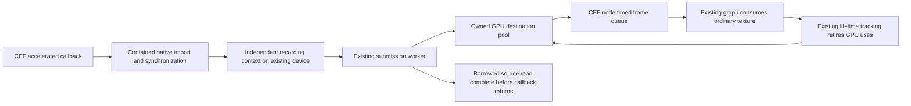

# CEF browser sources: investigation and recommendations

Research date: **2026-09-22**. This is a design investigation, not an implemented feature or a performance result.
Public source was inspected at the revisions below. Upstream development branches are evidence about available
interfaces, not a recommendation to ship unreleased binaries. All proposed names and configuration switches in this
document are illustrative.

Implementation evidence and pending explicit approvals are tracked in
[CEF implementation progress](cef-implementation-progress.md). That report does not supersede the constraints below.

## Recommended direction

Implement browser support as **an ordinary source node type and a contained CEF subsystem**, following the NDI and
DeckLink module boundaries. Browser sessions, transport selection, timing, commands and recovery belong to that
node's details and subsystem. Its graph output is the existing sampled texture interface: **no downstream node
should know or care that its texture came from CEF**. App state owns the shared runtime, not browser behavior.

Use **stock CEF 152.0.8 binary distributions, pinned per operating system and architecture**, behind a wrapper in
`src/wrapper/cef/`. Keep binaries out of Git and ship the complete tested runtime alongside the application. A
submodule can pin integration source, but cannot replace the binary SDK.

**Accelerated paint only. All frame copies, blits, conversions and popup composition must execute on the GPU.**
Implement `OnAcceleratedPaint`; do not implement a CPU pixel ingestion path, CPU staging/readback/upload transport,
or automatic unaccelerated fallback. If the CEF interface requires an `OnPaint` override, provide only the mandatory
stub that rejects unexpected delivery and reports unsupported operation; never copy or consume its pixels. CPU-side
metadata, handles, commands and synchronization bookkeeping are allowed. Unaccelerated support is deferred until the
accelerated implementation is confirmed and the user separately authorizes that work.

**Retain the established Miximus structure.** The main/render thread, GLFW event polling and window lifecycle,
scheduler, graph traversal, submission/presentation workers, existing nodes and texture interface keep their current
behavior. CEF adapts to these structures. Every deviation requires the user's specific, explicit approval **before
implementation**; a recommendation, experiment, performance result or general instruction to work through this plan
is not that approval.

Use Miximus's existing same-device, independent recording-context model for browser transfers. The CEF module owns
a bounded destination texture pool and a private transfer recording context; import the native CEF image, perform
GPU work into a free destination, finish borrowed-source reads before returning from the callback, and publish the
owned frame through the node's queue. Reuse existing submission, completion and lifetime tracking. New well-contained
resource-sharing/import/blit-completion helpers are authorized; rewriting existing rendering machinery is not.

Start by qualifying an embedded Windows/Linux runtime using CEF's supported threaded UI loop, with initialization
and teardown through the app-owned subsystem. macOS event-loop placement is a separate unresolved platform gate.
The previously proposed universal browser-host process and private frame IPC are **not selected or authorized**.
Any alternative topology must be presented to the user for specific approval; it is not a prerequisite for the GPU
pool design. Chromium's ordinary renderer/GPU subprocess helpers remain part of normal CEF packaging.

Borrow OBS's platform import/capability probing and CasparCG's owned-copy and queued-frame approach. Provide internal
custom-command/JSON-response infrastructure without choosing a public control model, WebSocket API or CasparCG
compatibility. Neither reference project authorizes changing Miximus's structure.

Expose explicit Miximus program time to cooperating templates. Treat exact identification of the pixels generated
for a particular PTS as a separate problem from injecting that PTS into JavaScript. Stock CEF does not establish
that correspondence automatically.

Follow **CasparCG's bounded, queued browser-frame approach** for stable frame delivery, adapted to Miximus's timed
source selection and late-frame recovery. The baseline is a free-running browser feeding owned frame history, not
a latest-texture-only source. Miximus is progressive-only: interlacing and field-pairing workarounds are permanently
out of scope, not deferred features.

## Evidence and versions

| Source | Inspected revision | Why it matters |
| --- | --- | --- |
| Miximus | `64a411e9533cb97acda8f783faf685caabdb9742` | Current Vulkan ownership, frame context, wrappers and packaging |
| [obs-browser](https://github.com/obsproject/obs-browser/tree/a1624431ae60cd89560d3d12c8143b1b926b410a) | `a1624431ae60cd89560d3d12c8143b1b926b410a` | Platform texture import, source lifecycle and helpers |
| [CasparCG Server](https://github.com/CasparCG/server/tree/fe88a73f7b67a19bc6cf2ca17852ee11695c70d8) | `fe88a73f7b67a19bc6cf2ca17852ee11695c70d8` | Current HTML producer and template commands |
| [CasparCG 2.3.3 LTS](https://github.com/CasparCG/server/tree/4de6d18f89d47fc03278dfb555c9338b6cf3ae57) | `4de6d18f89d47fc03278dfb555c9338b6cf3ae57` | Historical custom animation callbacks |
| [CEF 152.0.8](https://github.com/chromiumembedded/cef/tree/1ce985cb23056548b9cc51483bbef4faf68b1cd3) | `1ce985cb23056548b9cc51483bbef4faf68b1cd3` | Selected release; paint, timing, packaging and process headers checked |
| [CEF development reference](https://github.com/chromiumembedded/cef/tree/5df187ece78562092d93801c7004e2c583818ffa) | `5df187ece78562092d93801c7004e2c583818ffa` | Additional implementation examples; not the selected binary SDK |
| [OBS Studio 32.2.2](https://github.com/obsproject/obs-studio/tree/32.2.2) | obs-browser `3f0a2cdf378939ebe3c6f9ab36d4ea100c25aac2` | Released browser implementation and CEF dependency pin |
| [CasparCG 2.5.1](https://github.com/CasparCG/server/tree/ec38d94442387c95f05c816e66e6719c2e9e197f) | `ec38d94442387c95f05c816e66e6719c2e9e197f` | Released GPU copy, fence wait and CEF dependency pin |
| [MoltenVK](https://github.com/KhronosGroup/MoltenVK/tree/v1.4.1) | `v1.4.1` | Miximus's currently pinned macOS package baseline |

No CEF SDK was installed, browser source compiled, or platform interoperability benchmark run for this investigation.
The release baseline is selected below; enabling production platform paths still requires runtime qualification.

### Release baseline and update policy

Select **`152.0.8+g1ce985c+chromium-152.0.7977.134`** for the initial implementation. The automated build index lists
standard and minimal distributions for Linux x64, Windows x64, macOS arm64 and macOS x64, published on September 20.
These are platform variants of the same release. Pin the complete version, archive URL and reviewed digest for each
target rather than resolving a major version at configure time. See the
[CEF build index](https://cef-builds.spotifycdn.com/index.json).

This selection interprets “latest widely considered stable” as the newest maintained patch on a release line with
established stable-channel evidence. On the research date, the index also lists **154.0.23** as stable, newly
published on September 22 after beta builds. It is the newest stable-labelled artifact, but there is not yet enough
evidence here to describe its CEF integration as broadly proven. Chromium **152.0.7977.134** is also the September 17
Chrome Extended Stable update, providing a stronger maturity signal for the selected engine version. This is an
engineering judgment, not a claim that Chrome's channel certifies CEF's OSR implementation or that CEF has an LTS
guarantee. See [Chrome's release announcement](https://chromereleases.googleblog.com/2026/09/extended-stable-update-for-desktop_0130771745.html).

Build around the selected release's Chrome runtime and current public OSR APIs. Do not target the old Alloy runtime,
OBS-specific historical shared-texture APIs, or a development-only feature. Alloy-style windowless browsers and the
removed Alloy runtime are distinct concepts. Recheck the maintained stable releases when implementation begins;
advance the pin through a reviewed update with packaging, OSR, synchronization and timing regression checks. Do not
freeze permanently on 152 or let an automatic dependency update choose the browser runtime silently.

OBS 32.2.2 pins Chromium 127/CEF branch 6533; its development branch moved to 150/7871 on September 18. CasparCG 2.5.1
pins CEF 142 on Windows. Their operational experience is valuable, but neither old pin defines the new Miximus
baseline. See [OBS's release pin](https://github.com/obsproject/obs-studio/blob/32.2.2/CMakePresets.json),
[OBS's upgrade](https://github.com/obsproject/obs-studio/pull/13900), and
[CasparCG's pin](https://github.com/CasparCG/server/blob/ec38d94442387c95f05c816e66e6719c2e9e197f/src/CMakeModules/Bootstrap_Windows.cmake#L217).

## What the reference implementations teach us

### OBS: efficient pixel transport, with version-specific ownership

OBS's accelerated callback opens Windows NT shared textures, macOS IOSurfaces, or Linux DMA-BUF planes. Its CPU
callback uploads BGRA pixels. The Linux implementation handles formats/modifiers, including an X11-specific invalid
modifier workaround. It also has an extra texture path for format handling. These are concrete examples of avoiding
CPU readback, not a Vulkan implementation or a guarantee about performance on our hardware.
See [the paint implementations](https://github.com/obsproject/obs-browser/blob/a1624431ae60cd89560d3d12c8143b1b926b410a/browser-client.cpp#L302).

OBS also implements resize, reload, visibility/activity notifications, interaction events, and optional audio
capture. External begin-frame calls are behind compile-time guards; other paths use CEF's configured frame rate.
We should not assume all OBS builds are externally clocked.
See [source creation and lifecycle](https://github.com/obsproject/obs-browser/blob/a1624431ae60cd89560d3d12c8143b1b926b410a/obs-browser-source.cpp).

OBS separates its application/UI thread from its graphics thread. Browser paint callbacks enter a shared graphics
context guarded by a mutex. Miximus instead records on its render thread and submits asynchronously through a
worker; adopting OBS's process topology does not imply adopting its global graphics lock. See
[OBS's graphics loop](https://github.com/obsproject/obs-studio/blob/ea7536c49cb84420296d3831cda526c232fed3bc/libobs/obs-video.c#L1094)
and [context locking](https://github.com/obsproject/obs-studio/blob/ea7536c49cb84420296d3831cda526c232fed3bc/libobs/graphics/graphics.c#L275).

The inspected accelerated callback stores the imported resource for later rendering, and retains historical API
branches including `OnAcceleratedPaint2`. That is **not evidence that current stock CEF permits deferred access**.
Its behavior must be understood with the actual OBS CEF build and graphics backend. Miximus should follow the pinned
CEF contract, not infer ownership from this code. The useful lesson is platform import and probing, not a portable
borrowed-texture lifetime.

OBS isolates platform build details and supplies browser helper executables; macOS creates the base, GPU, Plugin,
and Renderer helper app variants with individual entitlements. Its integration depends on libobs and Qt and is not a
drop-in browser library. See [Windows](https://github.com/obsproject/obs-browser/blob/a1624431ae60cd89560d3d12c8143b1b926b410a/cmake/os-windows.cmake),
[Linux](https://github.com/obsproject/obs-browser/blob/a1624431ae60cd89560d3d12c8143b1b926b410a/cmake/os-linux.cmake), and
[macOS build integration](https://github.com/obsproject/obs-browser/blob/a1624431ae60cd89560d3d12c8143b1b926b410a/cmake/os-macos.cmake).

### CasparCG: template control and an important timing correction

The current producer accepts JavaScript calls, queues calls made before loading, and maintains bounded frame queues
with a retained last frame. Its Windows accelerated path opens D3D textures and passes them into the frame factory.
Linux shared textures are explicitly not enabled by its current HTML integration, even though GPU rendering can be
enabled. Thus “GPU-enabled browser” and “GPU texture delivery to the mixer” are different capabilities.
See [the producer](https://github.com/CasparCG/server/blob/fe88a73f7b67a19bc6cf2ca17852ee11695c70d8/src/modules/html/producer/html_producer.cpp)
and [runtime setup](https://github.com/CasparCG/server/blob/fe88a73f7b67a19bc6cf2ca17852ee11695c70d8/src/modules/html/html.cpp).

For cadence, the released 2.5.1 producer sets CEF's integer rate to `ceil(channel_fps)`, keeps up to four painted
frames, discards the oldest on overflow, and repeats the previous image on underrun. Its queue timestamps are host
arrival/import timestamps, not channel PTS or a request-to-pixel correlation. Adopt the bounded queue and retained
image principle; determine capacity and selection through Miximus's existing timing contracts rather than copying
the four-frame constant or FIFO-only consumption. Its interlaced field-pairing heuristic has no application to Miximus.
See [the released queue and consumption code](https://github.com/CasparCG/server/blob/ec38d94442387c95f05c816e66e6719c2e9e197f/src/modules/html/producer/html_producer.cpp#L212).

Following that import into the released 2.5.1 frame factory reveals a useful ownership precedent: the OpenGL path
copies the D3D texture into its own texture and waits for the copy future before returning. That future resolves
after an OpenGL fence signals, polled using a two-millisecond asynchronous timer. Thus its browser callback accepts
a wait to obtain independently owned pixels without a CPU round trip. Borrow the ownership boundary, using
Miximus's completion services instead of that polling policy. See
[frame import](https://github.com/CasparCG/server/blob/ec38d94442387c95f05c816e66e6719c2e9e197f/src/accelerator/ogl/image/image_mixer.cpp#L377)
and [copy completion](https://github.com/CasparCG/server/blob/ec38d94442387c95f05c816e66e6719c2e9e197f/src/accelerator/ogl/util/device.cpp#L305).

Do not mistake this for a Vulkan solution: CasparCG's inspected development Vulkan backend throws for D3D texture
import. Its Linux HTML path also leaves shared-texture delivery disabled despite its availability in modern CEF.
These are reasons to design the Vulkan integration around our requirements, rather than inherit all reference-project
limitations. See [the Vulkan import stub](https://github.com/CasparCG/server/blob/fe88a73f7b67a19bc6cf2ca17852ee11695c70d8/src/accelerator/vulkan/image/image_mixer.cpp#L383).

Its CG proxy maps operations to `play()`, `stop()`, `next()`, `update(data)`, `remove()`, and arbitrary invocation.
This demonstrates useful graphics-template interactions. Miximus should support structured custom requests and JSON
results internally; whether to expose these operations or add a compatibility layer remains a later decision.
See [the CG proxy](https://github.com/CasparCG/server/blob/fe88a73f7b67a19bc6cf2ca17852ee11695c70d8/src/modules/html/producer/html_cg_proxy.cpp).

**The PTS premise needs qualification.** In 2.3.3 LTS, CasparCG replaces `requestAnimationFrame` and
`cancelAnimationFrame`, receives a `TICK` process message, and drains the pending callbacks. However, the timestamp
passed to those callbacks is `performance.now()` in the renderer, not a channel PTS carried in the message.
The producer's update triggers the tick. This is host-triggered callback scheduling, not demonstrated PTS injection.
See [historical injected JavaScript](https://github.com/CasparCG/server/blob/4de6d18f89d47fc03278dfb555c9338b6cf3ae57/src/modules/html/html.cpp#L127)
and [historical tick sending](https://github.com/CasparCG/server/blob/4de6d18f89d47fc03278dfb555c9338b6cf3ae57/src/modules/html/producer/html_producer.cpp#L392).

The inspected current implementation no longer includes that replacement or tick handler. This investigation did
not verify a separate fork with actual PTS injection. We can implement that idea deliberately without claiming it is
the current CasparCG contract.

### CEF's ownership contract takes precedence

Current `OnAcceleratedPaint` documentation says the resource is pooled, must be reopened for each callback, cannot
be cached/accessed outside the callback, and must be copied to application-owned storage. Retaining a COM object,
duplicating an FD, or retaining an IOSurface can keep storage allocated without preventing CEF from overwriting it.
See [the callback contract](https://github.com/chromiumembedded/cef/blob/1ce985cb23056548b9cc51483bbef4faf68b1cd3/include/cef_render_handler.h#L152).

The separately inspected CEF development Metal example makes this concrete: it copies the visible image and finishes
the GPU reads before return,
and warns that retaining the source does not prevent reuse. This is stronger evidence for a conservative integration
than an application's historical sharing code.
See [the Metal OSR implementation](https://github.com/chromiumembedded/cef/blob/5df187ece78562092d93801c7004e2c583818ffa/tests/shared/browser/osr_renderer_metal.mm#L382).

Recommendation: complete every GPU read of CEF-owned storage before returning, unless the selected SDK supplies a
documented alternative synchronization/lifetime guarantee. Merely enqueueing a copy on Miximus's submission worker
is insufficient. A timeout after submission cannot make returning a still-in-use borrowed texture safe: recovery
must drain the use or enter a safe device-failure path, not just abandon the wait. Perform this work on the qualified
CEF callback/transfer side, not by waiting for Miximus's graph to execute. Qualify callback scheduling and bounded
GPU work independently of graph cadence.

## Acquiring and bundling CEF

### Options

| Approach | What it provides | Fit for Miximus |
| --- | --- | --- |
| Pinned prebuilt CEF binary SDK | Headers, wrapper source, CMake integration, native runtime/resources | **Recommended default**; reproducible without building Chromium |
| `cef-project` submodule | Examples and download/build scaffolding | Optional reference; still downloads a binary SDK |
| CEF source submodule | CEF source and patches | Only useful if maintaining a custom build; does not contain Chromium or built runtimes |
| OBS/CasparCG dependency artifacts | Their tested distribution choices | Useful comparison or mirror model; inspect provenance, patches and platform coverage before reuse |
| System CEF/package manager | Distribution-maintained SDK/runtime | Optional explicit override; less control over ABI, features and upgrade timing |
| Build Chromium/CEF ourselves | Control over patches, codecs and timing internals | Reserve for demonstrated requirements; substantial build and maintenance work |

CEF's binary distributions are standalone; CEF/Chromium source checkout is unnecessary for an application build.
The standard distribution includes samples; minimal distributions reduce development payload. Verify the contents
of the selected archive rather than equating “minimal” with “only libcef”.
See [CEF distribution information](https://cef-builds.spotifycdn.com/index.html) and
[CEF's project overview](https://github.com/chromiumembedded/cef).

`cef-project` demonstrates downloading/extracting a distribution and compiling against it. Its downloader uses the
published SHA-1 sidecar. For Miximus, record a reviewed SHA-256 digest and immutable URL in our own dependency manifest,
and verify cached archives too. Do not resolve “latest” during configure.
See [the upstream downloader](https://github.com/chromiumembedded/cef-project/blob/master/cmake/DownloadCEF.cmake).

CasparCG demonstrates another workable model: hosted dependency releases plus a Linux system-package option.
Its current build guide refers to a versioned CEF package. That is useful packaging precedent, not a reason to make
an Ubuntu PPA the portable Miximus dependency boundary.
See [its build guide](https://github.com/CasparCG/server/blob/fe88a73f7b67a19bc6cf2ca17852ee11695c70d8/BUILDING.md).

### Proposed build contract

Keep a manifest under the wrapper containing SDK version, Chromium version, CEF revision/API selection, target
OS/CPU, archive flavor, URL, SHA-256, patch provenance, and minimum supported OS/toolchain. Use the selected 152.0.8
release across the initial targets, qualify it, and commit exact per-target artifact pins. The source links to
development examples above are not permission to mix development headers with the release binary.

Suggested configuration:

- `MIXIMUS_ENABLE_CEF`: permit builds without browser support.
- `MIXIMUS_CEF_ROOT`: explicit pre-extracted SDK; validate against the manifest.
- `MIXIMUS_CEF_DOWNLOAD`: explicitly allow fetching the pinned SDK when absent.
- A build-tree/cache download location and optional controlled mirror, with offline builds supported.

Use the distribution's CMake package machinery, build `libcef_dll_wrapper` from the **matching SDK**, and expose
project-local wrapper targets. Confine CEF include paths, definitions, compiler/runtime settings and system libraries
to these targets. In particular, reconcile MSVC CRT/sandbox settings per target; do not globally copy OBS's compiler
flags. Keep the SDK's headers, wrapper, API version and runtime together even where CEF provides versioned ABI
compatibility.

Link the CEF SDK through the private wrapper into the contained CEF runtime implementation and ordinary Chromium
helper targets. Keep CEF headers out of app-state and ordinary node-facing interfaces. Subprocess entry points must
not initialize the Miximus graph or media services. Do not globally change compiler, loader or GPU configuration.

Use the standard SDK for the first prototype because its samples help reproduce upstream behavior. Switch CI to a
minimal archive only after testing the same packaged output. Never put binary archives or extracted runtimes in a
submodule, Git LFS, or the static-resource C++ bundler. The browser runtime needs a real filesystem layout.

Start with Linux x64, Windows x64 and macOS arm64 qualification; add macOS x64 and other architectures according to
actual product targets and archive availability. This is a proposed test order, not a claim of existing platform
support. Use separate architecture artifacts initially; universal macOS packaging is additional work.

### Runtime files and layout

The selected SDK's file lists and README are the source of truth. Current CEF's
[CMake runtime lists](https://github.com/chromiumembedded/cef/blob/1ce985cb23056548b9cc51483bbef4faf68b1cd3/cmake/cef_variables.cmake.in)
include the following examples; lists vary by version and architecture:

| Platform | Runtime payload and packaging concerns |
| --- | --- |
| Windows | `libcef.dll`, `chrome_elf.dll`, ANGLE/D3D support DLLs, snapshot, ICU, `.pak` resources, locales, SwiftShader/loader files; subprocess helper executables and matching runtime dependencies |
| Linux | `libcef.so`, ANGLE libraries, `chrome-sandbox`, snapshot, ICU, `.pak` resources, locales, SwiftShader/loader files; executable permissions, `$ORIGIN`-relative loading and declared system dependencies |
| macOS | Complete `Chromium Embedded Framework.framework`, resources/locales within its expected layout, helper `.app` variants and Miximus application metadata; nested signing and entitlements |

Use generated staging/install rules based on the SDK lists, with a manifest check for missing files. Symbols can be
separate downloads. Avoid manually pruning locale, fallback-renderer or resource files before testing the exact
result. Ship required notices from the distribution, including Chromium third-party notices; record the artifact's
codec configuration. Do not assume H.264/AAC, DRM or licensed codec support from the CEF name alone.
See [CEF's license](https://github.com/chromiumembedded/cef/blob/1ce985cb23056548b9cc51483bbef4faf68b1cd3/LICENSE.txt).

Use a dedicated CEF runtime directory where supported on Windows/Linux and qualify library coexistence in the
embedded process. CEF's bundled Vulkan loader/SwiftShader must not change Miximus's existing loader/ICD selection.
Do not alter the parent process's global loader environment as a workaround. macOS packaging and event-loop
integration remain subject to the platform gate below; runtime bundling is not permission to alter the app's loop.
Resolve paths from the installed executable/bundle, never the working directory.
CEF documents platform layouts and process initialization in its
[usage guide](https://chromiumembedded.github.io/cef/general_usage).

Keep cache, logs and profile data outside the installation. Use an absolute writable profile root per running
instance and deliberate request-context sharing between nodes. Ship an ordinary offline-capable runtime; a
first-launch browser download would complicate deterministic deployment.

Packaging acceptance must include clean machines without a CEF SDK, launch from another working directory,
non-ASCII/space-containing paths, offline operation, signed macOS artifacts, and Linux sandbox support under the
chosen packaging format. Use the selected CEF sandbox instructions; disabling the sandbox is not the deployment
strategy. Chromium subprocess helpers must enter `CefExecuteProcess` without initializing Miximus's graph, GLFW
windows, media registries or application GPU services.

## Miximus node and subsystem boundaries

The implementation must follow the existing media modules, not introduce a browser-aware graph execution path.
The concrete precedents are [NDI input](../src/nodes/ndi/input.cpp),
[NDI capture details](../src/nodes/ndi/detail/input_capture.hpp),
[DeckLink input](../src/nodes/decklink/input.cpp), and their app-owned
[NDI](../src/nodes/ndi/registry.hpp) and [DeckLink](../src/nodes/decklink/registry.hpp) registries.
Both inputs derive from `node_i`, expose `output_interface_s<const gpu::texture_s*>` named `tex`, manage asynchronous
capture through private details, and convert captured pixels before publishing the ordinary texture.
[App state](../src/core/app_state.hpp) owns the shared registries through forward-declared types; its
[implementation](../src/core/app_state.cpp) constructs and explicitly tears down the services.

Use the following ownership and file layout (new filenames/type names are illustrative):

| Location | Responsibility |
| --- | --- |
| `src/nodes/cef/input.cpp` | Browser source `node_i`: options, lifecycle hooks, frame selection, normal texture output and node status |
| `src/nodes/cef/detail/` | Per-node browser session, CEF clients/callbacks, request/result bridge, timing, bounded frame pools, accelerated ingress, platform bridge orchestration and recovery |
| `src/nodes/cef/subsystem.hpp/.cpp` and a forward header | Embedded CEF runtime, asynchronous session lifecycle, dispatch, capability snapshots and shutdown |
| `src/nodes/cef/register.hpp/.cpp` and `CMakeLists.txt` | Ordinary node factory registration and module sources, wired through the existing node registration/build lists |
| `src/wrapper/cef/` | SDK discovery, matching wrapper linkage, runtime packaging and subprocess-helper build integration |
| Contained GPU sharing helpers | Native image import, external-resource ownership and blit completion using existing device/recording/submission/lifetime structures; no CEF policy in shared GPU code |
| `web/src/nodes/` and existing status contracts | Matching editor node definition and normal options/status presentation |

The subsystem is app-owned like the media registries, but need not be called a registry: it manages a runtime and
sessions rather than discovering devices. Add a forward-declared owning member/accessor to `app_state_s`; construct
it through the normal app-owned service lifecycle and explicitly close/drain it before transfer/GPU services
disappear. Preserve the lightweight test-state constructor so graph lifecycle tests do not start Chromium.
App state only wires ownership, construction and teardown. No CEF event servicing is added to the main loop, frame
scheduler or window service. Per-browser state machines, JS dispatch, frame queues and transport selection stay in
the module. On Windows/Linux, CEF runs its supported threaded UI loop. Browser creation and control dispatch are
asynchronous; macOS implementation must wait for an explicitly approved solution to its event-loop gate.

### Node lifecycle and texture contract

- `init()` remains lightweight; browser creation/navigation is scheduled asynchronously through the subsystem.
- `prepare()` reads admitted options, advances session lifecycle and source timing, schedules program-time delivery,
  and publishes status. As with NDI/DeckLink, the enabled source remains hot even when disconnected. Browser callbacks
  publish bounded owned frames independently of graph demand.
- `submit()` selects/retains the appropriate source frame through the node details using the existing frame context.
  It must tolerate submission without execution; it does not add a CEF branch to the node manager or scheduler.
- `execute()` resolves that selected frame, records its typed producer dependency and any pixel conversion through
  `app->commands()`, and sets the ordinary `tex` output. GPU import and destination-pool leases stay internal. A late or
  unavailable frame is handled by retaining the last valid image or an ordinary GPU-created empty texture, without
  making consumers handle browser state.
- `complete()` releases frame-local CPU references; submitted GPU uses retain the actual storage until completion.
  Node destruction requests asynchronous session closure; the subsystem retains callbacks and resources until safe.

Publish the existing `const gpu::texture_s*` interface, with the same working color/alpha and sampling conventions as
other sources. Perform browser-specific channel ordering, orientation, alpha/color conversion and popup composition
before that boundary. Retain the output and backing pool lease for every submitted consumer use, including fan-out
and repeated/static frames. A raw interface pointer is not a substitute for recording/resource lifetime tracking.
Downstream transforms, switches, compositors and outputs must use their existing texture resolution and GPU commands
unchanged: no CEF handles, browser frame types, source-kind checks, JS calls or browser-specific readiness logic.

Keep option defaults/normalization and persistence on the authoritative native node, using existing registration and
schema conventions. Mirror the node type, `tex` port and approved options in the web definition and registration.
Publish described status contracts through the existing status registry/generator, rate-limit metrics and version
capability snapshots. The internal custom-command/JSON-response facility belongs to the session/subsystem; it does
not require a new graph interface type or decide a WebSocket protocol now.

### Hard scope boundary

Permitted integration wiring is the app-owned subsystem member/construction/teardown, ordinary native/web node and
status registration, and wrapper/build/install rules. Browser implementation belongs to its node, details, subsystem
and ordinary Chromium helpers. Do not edit existing nodes to accommodate the browser.

In particular, do not move the graph off the main thread, restructure `main.cpp`, change GLFW polling/window ownership,
alter `tick_one_frame()`, scheduler recovery, node lifecycle ordering, texture interfaces, or existing GPU submission,
transfer and presentation paths. Do not add a global browser tick or a new graph execution phase. Read the existing
frame context in the CEF node's normal `prepare()` hook and dispatch asynchronously from its details.

New well-contained resource-sharing, native-import, ownership-transition and blit-completion helpers are permitted.
They must fit the existing Vulkan device, independent recording contexts, submission worker and resource retirement
contracts. Small additive API plumbing for those helpers is not permission to replace or change existing paths.
If required device-extension enablement or resource support changes an established initialization/selection policy,
identify the exact change and obtain the user's specific, explicit approval first. Do not silently broaden global
GPU configuration or repurpose the upload/readback backend for CEF.

**Every structural deviation requires explicit user approval.** Name the affected existing mechanism, exact proposed
change, necessity and alternatives; wait for approval of that change before implementing it. This applies to all
stages, prototypes and platforms. A failed capability gate leaves that CEF path unsupported; it never authorizes CPU
pixel copies, an automatic process-topology switch, or a renderer refactor.

Acceptance requires running the same downstream graph with browser, NDI and DeckLink sources without changing any
consumer implementation. Verify accelerated browser delivery, fan-out, repeated frames, resize and source removal against
the same texture/lifetime contract. The node manager, interface traversal and compositor must gain no CEF special cases.

## Process and thread model

### Keep GPU sharing separate from CEF event-loop placement

The original render-thread relocation and the subsequent universal browser-host recommendation are superseded.
Miximus already has the appropriate cross-thread GPU structure: one device, independent recording contexts, a
submission worker, completion tickets and tracked resource lifetimes. CEF transfers should use that structure.
Neither native-handle import nor a separate recording context inherently requires another application process.

For Windows/Linux, qualify embedded CEF initialized/shut down through the app-owned subsystem on the application
main thread, using `multi_threaded_message_loop = true` for CEF UI work. Browser callbacks execute on that UI thread;
use a context owned by the callback/transfer implementation, never the graph's default recording context.
Do not insert `CefDoMessageLoopWork` into Miximus's frame loop. Ordinary Chromium renderer/GPU subprocesses and CEF's
internal process messages are expected; no additional browser-host process or frame IPC is selected.
See [CEF settings](https://github.com/chromiumembedded/cef/blob/1ce985cb23056548b9cc51483bbef4faf68b1cd3/include/internal/cef_types.h#L245)
and [initialization API](https://github.com/chromiumembedded/cef/blob/1ce985cb23056548b9cc51483bbef4faf68b1cd3/include/cef_app.h).

**macOS remains an explicit gate.** The supported threaded UI-loop setting is unavailable there. Determine whether a
supported, contained integration can meet CEF's native main-thread requirements without changing Miximus's event or
render loop. Do not assume an arbitrary worker can host the macOS UI loop. If this cannot be established, report the
constraint and alternatives, including a platform-specific browser host, for the user's explicit approval. Keep that
platform unsupported until resolved; do not move the graph, alter GLFW polling or impose a universal host to solve it.

OBS's embedded model and existing UI/graphics separation are reference evidence, not an architectural dependency.
Its worker-thread and Qt loop arrangements must be checked against the selected SDK rather than copied blindly.
See [OBS initialization](https://github.com/obsproject/obs-browser/blob/a1624431ae60cd89560d3d12c8143b1b926b410a/obs-browser-plugin.cpp#L271).

### Thread ownership and teardown

The existing main/render thread owns the ordinary CEF node lifecycle and frame selection, exactly as for other
nodes. CEF UI work owns browser creation, navigation and paint callbacks; renderer subprocess threads own V8.
Private workers may manage allocation/import preparation and asynchronous commands. Every recording context has a
single explicit host-side owner or serialized access; never record concurrently into the same context.

Publish owned frame descriptors through a bounded queue. Sharing a texture lease between threads does not copy
pixels. Pool slots remain retained until all selected/recorded/submitted uses retire. Node removal requests close
without waiting for browser completion during a frame; the subsystem retains callbacks and retiring resources.

During app shutdown, preserve the existing graph teardown and service order. Add the CEF subsystem's close/drain
before the GPU device disappears; its threaded CEF loop must be able to finish without Miximus pumping browser work.
Wait for `OnBeforeClose` and retire transfer/consumer uses before `CefShutdown` on its required thread. This is normal
subsystem ownership wiring, not permission to redesign shutdown, watchdog behavior or other services' lifetimes.
If the SDK cannot meet that contract, stop at the gate and obtain explicit approval for any necessary deviation.

## Accelerated rendering and texture sharing with Vulkan

### Existing structures are the starting point

[`device_s::create_recording_context()`](../src/gpu/device.hpp) already provides independent command/descriptor pools.
[`transfer_worker_s`](../src/gpu/transfer/detail/transfer_worker.hpp) uses one, while
[`recording_s`](../src/gpu/recording.hpp) supplies typed operations, dependencies and submission and
[`completion_s`](../src/gpu/completion.hpp) distinguishes accepted submission from GPU completion.
Use those mechanisms; do not introduce a second graph scheduler, a competing submitter on its queue, or a replacement
resource-lifetime system. A separate recording context does not imply a separate Vulkan device or GPU queue.

The missing functionality to qualify is native image import and its external synchronization, not ordinary
cross-thread texture sharing. The CUDA backend already demonstrates external allocation sharing and explicit
ownership, but its Vulkan-export-to-CUDA path is not automatically a D3D/DMA-BUF/IOSurface importer.
New contained helpers may supply those platform capabilities within the existing structures.

### Owned GPU frame pool and callback contract

1. Create a bounded pool of Miximus-owned GPU destination textures during session setup using the existing allocation
   conventions. Pool creation/import preparation may use a private resource worker, as other media services do;
   publish a complete generation before use. Do not synchronously allocate an entire pool on each paint or graph tick.
2. Own a separate recording context for CEF ingress on the same Vulkan device as the graph. The source's main-thread
   setup may establish the pool/context and hand ownership to its producer side; texture storage is device-owned,
   not tied to the thread that allocated it.
3. `OnAcceleratedPaint` acquires a genuinely free destination slot, opens the current native source handle and
   establishes the producer-read dependency. If no slot/context is available, drop the incoming paint before issuing
   GPU work; do not block graph execution or overwrite a retained frame.
4. Record a GPU copy or conversion from the imported source into that destination through the contained helper and
   existing recording/submission machinery. Channel order, color/alpha conversion and popup composition stay on GPU.
5. Submit and **finish every GPU read of CEF's borrowed source before returning from the callback**. A submission
   ticket or retained native handle alone does not authorize deferred reads. Use a contained blit-completion helper
   backed by existing completion primitives. The callback may wait for its GPU work; it must not wait for the graph
   to run, for a render-thread task, or for a destination slot held by consumers.
6. Publish the owned image and its metadata/completion through the source's bounded timed queue. Graph selection and
   downstream sampling use the ordinary texture interface and existing dependency/lifetime conventions.
7. Recycle the destination only after queued/selected references and all recorded/submitted GPU uses release it.
   `complete()` and `on_submitted()` are not evidence that GPU use has finished.

If later conversion reads only owned storage, it may remain asynchronous after the borrowed-source read completes.
Do not hold CEF's resource until that unrelated work finishes unnecessarily. A callback timeout after submission
cannot safely abandon a still-running read of borrowed storage; drain it or use a valid device-failure path. Measure
callback wait and queue contention; the existing queue architecture remains unchanged.

Use full-frame GPU copies initially; dropped paints and rotating slots make dirty-rectangle-only updates unsafe
without image-history tracking. Handle accelerated `PET_POPUP` frames and composition in the CEF module. Include
session/navigation/size generations, sequence, dimensions, format, visible rectangle, timestamp domain and ownership
in descriptors. No CPU pixel mapping or staging is permitted for these operations.

### Platform import qualification

| Platform | Native source | GPU-only candidate | What must be established |
| --- | --- | --- | --- |
| Windows | Shared D3D texture handle | Import compatible D3D memory into the existing Vulkan device and copy/convert into local owned textures; contained D3D11 GPU bridge if direct import cannot meet the contract | Adapter identity, handle type, allocation flags, supported format/usage and producer synchronization |
| Linux | DMA-BUF plane FDs and modifier/layout metadata | Import with matching external-memory/modifier support, then copy/convert into local owned textures | Format/modifier/plane compatibility, source readiness and external ownership/layout transitions |
| macOS | IOSurface | Compatible MoltenVK import or contained Metal copy into an owned shared surface consumed by Vulkan | Resource compatibility and Metal/Vulkan completion, plus the separate unresolved CEF UI-loop gate |

These are candidate paths, not validated interoperability claims. Qualify against the pinned binary and actual
adapters/drivers. Same-device sharing within Miximus avoids re-exporting ordinary Vulkan destination textures unless
a particular cross-API bridge needs it. Importing a handle does not itself imply a pixel copy; the owned destination
copy is required by CEF's borrowed-resource contract.

**Windows:** distinguish NT D3D texture handles (`D3D11_TEXTURE_BIT`) from legacy KMT and generic opaque handles.
Match CEF/DXGI and Vulkan adapters using device identity, not enumeration order. Establish actual resource usage and
synchronization; do not assume a keyed mutex or invent its key protocol. `Flush` alone does not establish GPU
completion. A D3D bridge, if necessary, belongs in contained sharing details and must hand off to the existing Vulkan
resource/lifetime model. No CPU readback is allowed.
See [external-memory handle types](https://docs.vulkan.org/refpages/latest/refpages/source/VkExternalMemoryHandleTypeFlagBits.html)
and [keyed-mutex extension](https://docs.vulkan.org/refpages/latest/refpages/source/VK_KHR_win32_keyed_mutex.html).

**Linux:** honor DMA-BUF plane FDs, offsets, pitches, format and DRM modifier; do not treat a DMA-BUF as an opaque
Vulkan FD. Validate importability and descriptor ownership/cleanup. The inspected CEF paint structure does not supply
an explicit acquire sync FD: establish source readiness from the actual CEF/Chromium path and driver contract before
reading. Where applicable, investigate reservation-fence export and explicit Vulkan waits; `DMA_BUF_IOCTL_SYNC` is
CPU coherency, not GPU synchronization. Test NVIDIA and Mesa configurations separately. Failure leaves accelerated
support unavailable for that configuration; it does not enable CPU fallback. An additional EGL backend is not selected;
propose and obtain explicit user approval before adding another graphics backend as a workaround.
See [modifier import](https://docs.vulkan.org/refpages/latest/refpages/source/VkImageDrmFormatModifierExplicitCreateInfoEXT.html)
and [DMA-BUF synchronization](https://docs.kernel.org/driver-api/dma-buf.html).

**macOS:** qualify IOSurface-compatible image configuration and import through MoltenVK, with a private Metal bridge
if needed. Finishing the borrowed-source read and retaining the owned destination are separate obligations. Keep
Objective-C++ and native types private. Do not change existing GLFW/window/presentation behavior to qualify this path.
See [IOSurface import](https://docs.vulkan.org/refpages/latest/refpages/source/VkImportMetalIOSurfaceInfoEXT.html),
[MoltenVK extensions](https://github.com/KhronosGroup/MoltenVK/blob/v1.4.1/MoltenVK/Layers/MVKExtensions.def) and
[existing platform validation](macos-moltenvk-validation.md).

### Color, bandwidth and failure behavior

Use tested SDR sRGB with premultiplied alpha at the browser boundary and convert on GPU into Miximus's existing
linear premultiplied UNORM16 working representation. For premultiplied encoded input, unpremultiply where alpha is
nonzero, decode sRGB, then premultiply in linear light; do not gamma-correct alpha. Test transparent black, low alpha,
antialiased text, popups, channel order and orientation without adding a CPU pixel-conversion path.

Measure GPU copy/conversion time, callback waits, queue contention and memory. A tightly packed BGRA source contains
about 8.29 MB at 1080p or 33.18 MB at UHD; 60 full-frame copies/s represent about 0.50 or 1.99 GB/s of source payload,
respectively, before destination writes/conversion and other GPU work. These are arithmetic, not timings or guaranteed
physical memory traffic. Include destination pools, imported views, working textures and Chromium allocations in budgets.

If accelerated delivery, import, synchronization or adapter matching is unavailable, expose an explicit unsupported/
error state. Retain the last valid owned frame only while safe, or expose the node's ordinary empty GPU texture.
Do not recreate in CPU mode, enable software rendering to evade the restriction, or transfer pixels via shared host
memory. A GPU-only path may be unsupported on some platforms until qualified. CPU support is separate later work.

## JavaScript control and program-time rendering

### Custom request and JSON-response infrastructure

The scope here is capability, not a control model. Ensure native code can send a custom request with JSON data to
browser-side JavaScript and asynchronously receive a correlated JSON result or an explicit error. No CasparCG command
set, public JavaScript namespace, WebSocket action, editor control or compatibility adapter is selected by this plan.

Use the subsystem's local dispatch and CEF browser/renderer process messages to carry owning request data and
results. Preserve request IDs and session generations across dispatch. Execute JavaScript on the
renderer/V8 thread in the intended context. `ExecuteJavaScript` alone is fire-and-forget and does not supply the
required result channel; provide an explicit renderer-side result bridge. Preserve the ability to handle asynchronous
JavaScript results, including Promise resolution/rejection, without blocking CEF or the graph.

The infrastructure needs request IDs, browser/navigation generations, JSON serialization, explicit exception and
non-serializable-result handling, bounded payloads/pending requests, and timeout/cancellation behavior. Navigation,
context destruction, source removal and renderer termination must settle pending requests and reject stale replies.
Do not replay or coalesce arbitrary custom commands: their side effects are unknown. An execution/result response
does not acknowledge that resulting pixels have been painted.

Keep this capability behind the native browser service so later work can choose WebSocket exposure, template APIs,
CasparCG compatibility or other interaction models independently. Reserve context-created/load lifecycle hooks and
the ability to distinguish page load from application readiness, without specifying a public handshake now. Limit
request execution to intended frames/contexts; it must not grant loaded content general mixer control.

Assume reload, custom CSS injection and similar browser controls will be supported. Preserve the lifecycle hooks
needed to reapply configuration after navigation/reload, but defer their API, UI, persistence and detailed behavior.
This investigation adds no implementation of these controls. If future work exposes them through WebSocket, define
and validate the native and generated TypeScript contracts together at that stage.

### Three different timing promises

| Mode | Promise | Limitation |
| --- | --- | --- |
| Ordinary web page | Browser runs normally; Miximus selects delivered frames | Chromium timing and callback arrival are independent of program PTS |
| Cooperative template | JS receives explicit program time and updates from that time | A JS acknowledgement does not prove the corresponding pixels have been painted |
| Strict frame rendering | Every delivered frame identifies the exact requested program PTS | Requires a verified compositor/frame correlation mechanism; not established by this investigation |

CEF's stock `SendExternalBeginFrame()` has no timestamp or user frame-ID argument. It can request work but cannot
directly inject our rational program PTS. CEF's accelerated metadata includes a capture-relative timestamp in
microseconds and an optional capture counter; neither is a Miximus request token. See [begin-frame API](https://github.com/chromiumembedded/cef/blob/1ce985cb23056548b9cc51483bbef4faf68b1cd3/include/cef_browser.h#L737)
and [paint metadata](https://github.com/chromiumembedded/cef/blob/1ce985cb23056548b9cc51483bbef4faf68b1cd3/include/internal/cef_types_osr.h).

A future cooperative timing callback needs epoch, frame number, PTS, timebase, duration and discontinuity metadata;
its public name and signature are deferred with the rest of the interaction API.
Keep exact native values as `utils::flicks`; transport large integer values as decimal strings or an agreed BigInt
encoding, with a convenient relative-millisecond value for JS animation libraries. Do not equate program PTS with
`Date.now()` or Chromium's time origin.

Use the immutable [current frame context](../src/core/frame_context.hpp). The CEF node's existing `prepare()` hook
hands time to its private session queue, including when the source is not demanded; no global timing/control path
or scheduler hook is added. Dispatch from subsystem workers. Do not coalesce away program frames still eligible for
Miximus's late-frame recovery; discard obsolete requests only when their program frames have been abandoned.
Preserve epoch changes and PTS gaps. Templates should derive state from absolute supplied time rather than increment an
animation counter once per callback. Source-local `play` origins should explicitly map onto program time.

If a compatibility shim replaces `requestAnimationFrame`, make it opt-in for controlled templates. It must support
cancellation, callback-list snapshot semantics, exceptions and navigation teardown. Document that CSS animations,
Web Animations, media playback, workers and third-party uses of `performance.now()` remain on Chromium clocks unless
separately controlled. Altering rAF timestamps does not synchronize all browser activity.

### Correlation and buffering

The default is a free-running CEF browser feeding a bounded queue of owned frames. Prioritize stable program-frame
delivery over minimum image age. External begin-frame scheduling is an optional pacing experiment, not a prerequisite
for this baseline or a guarantee of frame correlation.

Keep capture and CEF event processing independent of graph evaluation. Select from queued history using the existing
timed-source mechanisms and a configured source delay; never replace a still-needed frame merely because a newer
paint arrived. Retain enough history for Miximus's recoverable one-frame lateness, capture jitter and in-flight GPU
uses. Buffer capacity and presentation delay are separate choices; their exact values require measurement.
When the mixer catches up, consume the appropriate historical frames rather than issuing a burst of browser ticks.
Repeat the retained image on underrun. Under sustained overload, keep storage bounded, retire obsolete frames and
report drops; if no safe free slot exists, drop the incoming paint without blocking the graph or reusing leased storage.
Flush incompatible history on session/format generations and timeline discontinuities through the source adapter.

This can recover a late program evaluation when its browser image was captured and retained. It cannot reconstruct
animation states Chromium skipped. Independent browser/program clocks and integer-versus-rational rates can still
require deliberate repeats or drops; buffering does not establish exact PTS correspondence.

Dispatch template updates on the renderer thread, acknowledge execution, then request/invalidate rendering as
appropriate. **Do not label the next paint with that request's PTS just because it arrived afterward.** Unrelated
damage, compositor latency, coalescing and unchanged pages break a one-request/one-paint assumption.

For ordinary pages, keep capture timestamps in their own domain, record arrival separately, and use an explicitly
estimated mapping into program time. Retain static frames across missing
paints instead of treating every missing paint as failure. Use liveness/load/renderer signals to distinguish a static
page from a hung renderer.

For cooperative templates, keep requested PTS, JS execution acknowledgement and received capture identity as distinct
fields. A diagnostic page should draw its frame number/PTS into pixels so recorded output can measure their actual
relationship. One outstanding tick may simplify experiments but is not proof of compositor correlation.

If exact frame-PTS output is required, investigate a maintained CEF/Chromium change carrying begin-frame timing and
identity through capture, or a constrained rendering protocol whose pixel correlation can be proved. Evaluate this
before promising deterministic broadcast graphics. That may justify a custom CEF build; ordinary JS injection alone
does not.

Plan a small configurable browser lead/buffer, with a measurable latency target and a bounded queue. Requesting a
page update during `execute()` cannot make it available synchronously for that evaluation. Define what happens to
commands issued from the CEF node when browser pixels appear later. Exact same-frame graph/template transactions
are not promised and do not authorize scheduler, graph-transaction or shared timing changes. Any such deviation
requires the user's specific, explicit approval before implementation. Reuse the existing timed-source mechanisms
for independently clocked browser frames; program-controlled, genuinely correlated frames should use their known
program mapping without adaptive clock drift.

Preserve the current frame lifecycle and `nodes_copy_` snapshot. The broader
[timing plan](frame-timing-and-synchronization.md) contains future work; browser support must not assume all of it is
already implemented.

## Lifecycle, recovery and initial node scope

Suggested first node: URL/local template, explicit viewport width/height, transparency, enabled state and one texture
output. Expose only qualified accelerated delivery; no CPU transport selector or automatic fallback. Default source
behavior should remain hot even when disconnected, matching the media architecture. An explicit stop/suspend policy
can come later.
Initially mute browser audio: audio playout is a separate timing/integration project, not an implicit OS output.

Browser service state should progress through starting, loading, ready, closing and closed, with failure/restart states.
Navigation and resize increment generations. Renderer termination fails pending commands and starts bounded recovery
with backoff. Repeated interop failure reports an accelerated-path error and stops unsafe ingress. Recreating a
browser must preserve accelerated-only operation. Never disable shared-texture delivery or enable CPU/software
rendering as recovery.

Expose transport/backend, CEF/Chromium versions, selected adapter, load/error status, viewport, paint sequence,
timing quality, queue depth, copy duration, stale-frame age, drops, restarts and accelerated-path failure reason.
Rate-limit counters and send status deltas. Discrete capabilities should update only when their version/selection changes.

On node removal, detach render references and request asynchronous browser close. Keep callbacks and pools alive
until close is acknowledged and all submitted GPU uses retire. On application exit, stop commands/ticks, close
browsers and observe `OnBeforeClose` on CEF's UI thread, drain imported frames, then call `CefShutdown` on the required
initialization thread. Keep Miximus's GPU device alive while imported resources drain. Renderer recovery invalidates
generations without reusing slots still referenced by the graph. Keep teardown within the existing service-lifetime
boundary; do not add CEF event pumping to Miximus's loop. Embedded browser-process crashes are not isolated from Miximus.

Serve local templates through a controlled asset origin/custom scheme with well-defined relative URLs and MIME
types. Use the native permission defaults deliberately: navigation, popup windows, downloads, camera/microphone,
file access and developer tools need policy. Do not inherit CasparCG's global web-security bypass or automatic media
permission switches merely for compatibility. Keep template content separate from the editor's privileged origin.

## Implementation order and explicit approval gates

| Stage | Deliverable | Evidence required before proceeding |
| --- | --- | --- |
| 0. Existing-structure fit | Map accelerated import, owned pool, independent recording context and callback completion onto current APIs; identify exact missing helpers and platform constraints | No render/window/scheduler changes; every proposed structural deviation explicitly approved by the user before implementation |
| 1. SDK and embedded runtime | Pinned SDK/wrapper, ordinary Chromium helpers and app-owned contained subsystem; qualify Windows/Linux threaded UI loop | Supported initialization/close/shutdown without main-loop servicing; packaging and loader coexistence; macOS remains gated, not silently redesigned |
| 2. Accelerated source | Native/web source node, contained native import/sharing helpers, GPU pool, blit completion, timed queue and ordinary `tex` output | All pixel copies/conversions on GPU; source reads complete before callback return; existing consumers unchanged; transparency/popup/resize tests and bounded memory |
| 3. Interaction and timing infrastructure | Internal custom-request/JSON-result bridge, lifecycle hooks and node-local program-time delivery | Correlated replies and navigation invalidation; no global timing hooks or new public control model |
| 4. Platform qualification | Windows/Linux GPU import paths; macOS only after its event-loop gate is explicitly resolved | Adapter/format/synchronization and driver stress tests; no CPU fallback; deviations require specific explicit user approval |
| 5. Production hardening | Accelerated-path recovery, deployment artifacts and diagnostics | Multi-source soak, crashes, GPU pressure, lifecycle and offline installation tests; no changes to existing render behavior |
| 6. Strict timing, if separately required | Proven request-to-pixel mapping, potentially a custom CEF build | Separate user approval before expanding scope; no scheduler or graph changes inferred from timing goals |

The implementation priority is the accelerated path. There is no CPU-first milestone, shared-memory pixel transport,
unaccelerated rescue path or CPU/GPU transport abstraction to implement now. Confirm the fast path first; any later
unaccelerated implementation requires separate authorization. A small mandatory `OnPaint` interface stub is not a
pixel ingestion implementation and must never silently accept software delivery.

Benchmark accelerated delivery at HD/UHD, one/four/eight sources, transparency, Canvas/WebGL, CSS animation, static
and moving content. Measure GPU copy/conversion and completion waits, callback p50/p95/p99/max, graph deadline misses,
pixel-observed latency, repeated/dropped frames, pool occupancy and process/GPU memory. CPU time measurements concern
control/driver overhead, not permission for CPU pixel copies. Record CEF build, adapter and driver; do not assume OBS's
performance transfers to Miximus.

Use focused tests for pool/lease generations, command ordering and completion. GPU/platform tests must cover delayed
blits, slot exhaustion, source removal with in-flight work, navigation/resize, popups, static retention, renderer/GPU
subprocess failure and shutdown. Validate rendered color/alpha and visible frame IDs against reference fixtures.
Do not use test instrumentation as permission to implement a CPU paint, pixel-copy or fallback path.

Compare the existing screen/NDI/DeckLink graph with CEF disabled, idle and under load, including its recoverable late
frame case. Verify unchanged scheduling/ownership implementations as well as measured contention. Follow native/web
formatting and build checks; successful compilation does not qualify hardware synchronization.

If a stage cannot fit the established structures, report the exact dependency and alternatives to the user. Do not
change the main structure, switch to a separate host, alter existing services or introduce CPU copies to pass a gate.
Only the user's specific, explicit approval authorizes a deviation; the plan itself cannot grant that approval.
