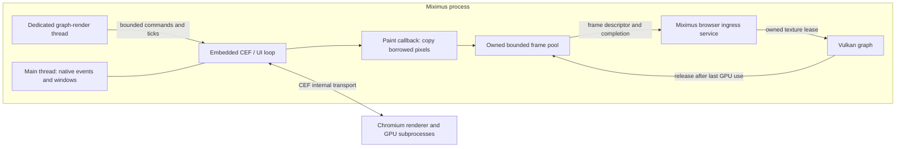

# CEF browser sources: investigation and recommendations

Research date: **2026-09-22**. This is a design investigation, not an implemented feature or a performance result.
Public source was inspected at the revisions below. Upstream development branches are evidence about available
interfaces, not a recommendation to ship unreleased binaries. All proposed names and configuration switches in this
document are illustrative.

## Recommended direction

Implement browser support as **an ordinary source node type and a contained CEF subsystem**, following the NDI and
DeckLink module boundaries. Browser sessions, transport selection, timing, commands and recovery belong to that
node's details and subsystem. Its graph output is the existing sampled texture interface: **no downstream node
should know or care that its texture came from CEF**. App state owns the shared runtime, not browser behavior.

Use **stock CEF 152.0.8 binary distributions, pinned per operating system and architecture**, behind a wrapper in
`src/wrapper/cef/`. Keep binaries out of Git and ship the complete tested runtime alongside the application. Start
with off-screen CPU frames through Miximus's bounded upload service, while developing GPU import experiments against
the same frame-ownership contract. A submodule can pin integration source, but cannot replace the binary SDK.

Follow **OBS's embedded CEF browser-process model**: initialize one CEF runtime inside Miximus, create multiple browser
instances, and package helpers for Chromium's ordinary renderer/GPU subprocesses. Do not add a separate
application-owned browser-host process or a second frame-transport IPC layer. Separate the main-thread event/window
service from a dedicated graph-render thread, preserving render-thread node ownership and frame ordering. This is
an explicit planned change to today's main-thread render loop, not existing behavior; see the process model below.

Borrow OBS's platform-specific GPU import and capability probing. Use CasparCG as evidence of useful interaction
capabilities, without choosing its control model. Provide infrastructure for custom commands and JSON responses;
defer public APIs, WebSocket exposure and compatibility decisions. Target **no CPU pixel round trip** for accelerated
rendering, with a GPU copy into an owned bounded frame pool. The selected CEF release does not offer a general asynchronous lease
on its paint texture.

Expose explicit Miximus program time to cooperating templates. Treat exact identification of the pixels generated
for a particular PTS as a separate problem from injecting that PTS into JavaScript. Stock CEF does not establish
that correspondence automatically.

Follow **CasparCG's bounded, queued browser-frame approach** for stable frame delivery, adapted to Miximus's timed
source selection and late-frame recovery. The baseline is a free-running browser feeding owned frame history, not
a latest-texture-only source. Miximus is progressive-only: interlacing and field-pairing workarounds are permanently
out of scope, not deferred features.

## Evidence and versions

| Source | Inspected revision | Why it matters |
| --- | --- | --- |
| Miximus | `64a411e9533cb97acda8f783faf685caabdb9742` | Current Vulkan ownership, frame context, wrappers and packaging |
| [obs-browser](https://github.com/obsproject/obs-browser/tree/a1624431ae60cd89560d3d12c8143b1b926b410a) | `a1624431ae60cd89560d3d12c8143b1b926b410a` | Platform texture import, source lifecycle and helpers |
| [CasparCG Server](https://github.com/CasparCG/server/tree/fe88a73f7b67a19bc6cf2ca17852ee11695c70d8) | `fe88a73f7b67a19bc6cf2ca17852ee11695c70d8` | Current HTML producer and template commands |
| [CasparCG 2.3.3 LTS](https://github.com/CasparCG/server/tree/4de6d18f89d47fc03278dfb555c9338b6cf3ae57) | `4de6d18f89d47fc03278dfb555c9338b6cf3ae57` | Historical custom animation callbacks |
| [CEF 152.0.8](https://github.com/chromiumembedded/cef/tree/1ce985cb23056548b9cc51483bbef4faf68b1cd3) | `1ce985cb23056548b9cc51483bbef4faf68b1cd3` | Selected release; paint, timing, packaging and process headers checked |
| [CEF development reference](https://github.com/chromiumembedded/cef/tree/5df187ece78562092d93801c7004e2c583818ffa) | `5df187ece78562092d93801c7004e2c583818ffa` | Additional implementation examples; not the selected binary SDK |
| [OBS Studio 32.2.2](https://github.com/obsproject/obs-studio/tree/32.2.2) | obs-browser `3f0a2cdf378939ebe3c6f9ab36d4ea100c25aac2` | Released browser implementation and CEF dependency pin |
| [CasparCG 2.5.1](https://github.com/CasparCG/server/tree/ec38d94442387c95f05c816e66e6719c2e9e197f) | `ec38d94442387c95f05c816e66e6719c2e9e197f` | Released GPU copy, fence wait and CEF dependency pin |
| [MoltenVK](https://github.com/KhronosGroup/MoltenVK/tree/v1.4.1) | `v1.4.1` | Miximus's currently pinned macOS package baseline |

No CEF SDK was installed, browser source compiled, or platform interoperability benchmark run for this investigation.
The release baseline is selected below; enabling production platform paths still requires runtime qualification.

### Release baseline and update policy

Select **`152.0.8+g1ce985c+chromium-152.0.7977.134`** for the initial implementation. The automated build index lists
standard and minimal distributions for Linux x64, Windows x64, macOS arm64 and macOS x64, published on September 20.
These are platform variants of the same release. Pin the complete version, archive URL and reviewed digest for each
target rather than resolving a major version at configure time. See the
[CEF build index](https://cef-builds.spotifycdn.com/index.json).

This selection interprets “latest widely considered stable” as the newest maintained patch on a release line with
established stable-channel evidence. On the research date, the index also lists **154.0.23** as stable, newly
published on September 22 after beta builds. It is the newest stable-labelled artifact, but there is not yet enough
evidence here to describe its CEF integration as broadly proven. Chromium **152.0.7977.134** is also the September 17
Chrome Extended Stable update, providing a stronger maturity signal for the selected engine version. This is an
engineering judgment, not a claim that Chrome's channel certifies CEF's OSR implementation or that CEF has an LTS
guarantee. See [Chrome's release announcement](https://chromereleases.googleblog.com/2026/09/extended-stable-update-for-desktop_0130771745.html).

Build around the selected release's Chrome runtime and current public OSR APIs. Do not target the old Alloy runtime,
OBS-specific historical shared-texture APIs, or a development-only feature. Alloy-style windowless browsers and the
removed Alloy runtime are distinct concepts. Recheck the maintained stable releases when implementation begins;
advance the pin through a reviewed update with packaging, OSR, synchronization and timing regression checks. Do not
freeze permanently on 152 or let an automatic dependency update choose the browser runtime silently.

OBS 32.2.2 pins Chromium 127/CEF branch 6533; its development branch moved to 150/7871 on September 18. CasparCG 2.5.1
pins CEF 142 on Windows. Their operational experience is valuable, but neither old pin defines the new Miximus
baseline. See [OBS's release pin](https://github.com/obsproject/obs-studio/blob/32.2.2/CMakePresets.json),
[OBS's upgrade](https://github.com/obsproject/obs-studio/pull/13900), and
[CasparCG's pin](https://github.com/CasparCG/server/blob/ec38d94442387c95f05c816e66e6719c2e9e197f/src/CMakeModules/Bootstrap_Windows.cmake#L217).

## What the reference implementations teach us

### OBS: efficient pixel transport, with version-specific ownership

OBS's accelerated callback opens Windows NT shared textures, macOS IOSurfaces, or Linux DMA-BUF planes. Its CPU
callback uploads BGRA pixels. The Linux implementation handles formats/modifiers, including an X11-specific invalid
modifier workaround. It also has an extra texture path for format handling. These are concrete examples of avoiding
CPU readback, not a Vulkan implementation or a guarantee about performance on our hardware.
See [the paint implementations](https://github.com/obsproject/obs-browser/blob/a1624431ae60cd89560d3d12c8143b1b926b410a/browser-client.cpp#L302).

OBS also implements resize, reload, visibility/activity notifications, interaction events, and optional audio
capture. External begin-frame calls are behind compile-time guards; other paths use CEF's configured frame rate.
We should not assume all OBS builds are externally clocked.
See [source creation and lifecycle](https://github.com/obsproject/obs-browser/blob/a1624431ae60cd89560d3d12c8143b1b926b410a/obs-browser-source.cpp).

OBS separates its application/UI thread from its graphics thread. Browser paint callbacks enter a shared graphics
context guarded by a mutex. Miximus instead records on its render thread and submits asynchronously through a
worker; adopting OBS's process topology does not imply adopting its global graphics lock. See
[OBS's graphics loop](https://github.com/obsproject/obs-studio/blob/ea7536c49cb84420296d3831cda526c232fed3bc/libobs/obs-video.c#L1094)
and [context locking](https://github.com/obsproject/obs-studio/blob/ea7536c49cb84420296d3831cda526c232fed3bc/libobs/graphics/graphics.c#L275).

The inspected accelerated callback stores the imported resource for later rendering, and retains historical API
branches including `OnAcceleratedPaint2`. That is **not evidence that current stock CEF permits deferred access**.
Its behavior must be understood with the actual OBS CEF build and graphics backend. Miximus should follow the pinned
CEF contract, not infer ownership from this code. The useful lesson is platform import and probing, not a portable
borrowed-texture lifetime.

OBS isolates platform build details and supplies browser helper executables; macOS creates the base, GPU, Plugin,
and Renderer helper app variants with individual entitlements. Its integration depends on libobs and Qt and is not a
drop-in browser library. See [Windows](https://github.com/obsproject/obs-browser/blob/a1624431ae60cd89560d3d12c8143b1b926b410a/cmake/os-windows.cmake),
[Linux](https://github.com/obsproject/obs-browser/blob/a1624431ae60cd89560d3d12c8143b1b926b410a/cmake/os-linux.cmake), and
[macOS build integration](https://github.com/obsproject/obs-browser/blob/a1624431ae60cd89560d3d12c8143b1b926b410a/cmake/os-macos.cmake).

### CasparCG: template control and an important timing correction

The current producer accepts JavaScript calls, queues calls made before loading, and maintains bounded frame queues
with a retained last frame. Its Windows accelerated path opens D3D textures and passes them into the frame factory.
Linux shared textures are explicitly not enabled by its current HTML integration, even though GPU rendering can be
enabled. Thus “GPU-enabled browser” and “GPU texture delivery to the mixer” are different capabilities.
See [the producer](https://github.com/CasparCG/server/blob/fe88a73f7b67a19bc6cf2ca17852ee11695c70d8/src/modules/html/producer/html_producer.cpp)
and [runtime setup](https://github.com/CasparCG/server/blob/fe88a73f7b67a19bc6cf2ca17852ee11695c70d8/src/modules/html/html.cpp).

For cadence, the released 2.5.1 producer sets CEF's integer rate to `ceil(channel_fps)`, keeps up to four painted
frames, discards the oldest on overflow, and repeats the previous image on underrun. Its queue timestamps are host
arrival/import timestamps, not channel PTS or a request-to-pixel correlation. Adopt the bounded queue and retained
image principle; determine capacity and selection through Miximus's existing timing contracts rather than copying
the four-frame constant or FIFO-only consumption. Its interlaced field-pairing heuristic has no application to Miximus.
See [the released queue and consumption code](https://github.com/CasparCG/server/blob/ec38d94442387c95f05c816e66e6719c2e9e197f/src/modules/html/producer/html_producer.cpp#L212).

Following that import into the released 2.5.1 frame factory reveals a useful ownership precedent: the OpenGL path
copies the D3D texture into its own texture and waits for the copy future before returning. That future resolves
after an OpenGL fence signals, polled using a two-millisecond asynchronous timer. Thus its browser callback accepts
a wait to obtain independently owned pixels without a CPU round trip. Borrow the ownership boundary, using
Miximus's completion services instead of that polling policy. See
[frame import](https://github.com/CasparCG/server/blob/ec38d94442387c95f05c816e66e6719c2e9e197f/src/accelerator/ogl/image/image_mixer.cpp#L377)
and [copy completion](https://github.com/CasparCG/server/blob/ec38d94442387c95f05c816e66e6719c2e9e197f/src/accelerator/ogl/util/device.cpp#L305).

Do not mistake this for a Vulkan solution: CasparCG's inspected development Vulkan backend throws for D3D texture
import. Its Linux HTML path also leaves shared-texture delivery disabled despite its availability in modern CEF.
These are reasons to design the Vulkan integration around our requirements, rather than inherit all reference-project
limitations. See [the Vulkan import stub](https://github.com/CasparCG/server/blob/fe88a73f7b67a19bc6cf2ca17852ee11695c70d8/src/accelerator/vulkan/image/image_mixer.cpp#L383).

Its CG proxy maps operations to `play()`, `stop()`, `next()`, `update(data)`, `remove()`, and arbitrary invocation.
This demonstrates useful graphics-template interactions. Miximus should support structured custom requests and JSON
results internally; whether to expose these operations or add a compatibility layer remains a later decision.
See [the CG proxy](https://github.com/CasparCG/server/blob/fe88a73f7b67a19bc6cf2ca17852ee11695c70d8/src/modules/html/producer/html_cg_proxy.cpp).

**The PTS premise needs qualification.** In 2.3.3 LTS, CasparCG replaces `requestAnimationFrame` and
`cancelAnimationFrame`, receives a `TICK` process message, and drains the pending callbacks. However, the timestamp
passed to those callbacks is `performance.now()` in the renderer, not a channel PTS carried in the message.
The producer's update triggers the tick. This is host-triggered callback scheduling, not demonstrated PTS injection.
See [historical injected JavaScript](https://github.com/CasparCG/server/blob/4de6d18f89d47fc03278dfb555c9338b6cf3ae57/src/modules/html/html.cpp#L127)
and [historical tick sending](https://github.com/CasparCG/server/blob/4de6d18f89d47fc03278dfb555c9338b6cf3ae57/src/modules/html/producer/html_producer.cpp#L392).

The inspected current implementation no longer includes that replacement or tick handler. This investigation did
not verify a separate fork with actual PTS injection. We can implement that idea deliberately without claiming it is
the current CasparCG contract.

### CEF's ownership contract takes precedence

Current `OnAcceleratedPaint` documentation says the resource is pooled, must be reopened for each callback, cannot
be cached/accessed outside the callback, and must be copied to application-owned storage. Retaining a COM object,
duplicating an FD, or retaining an IOSurface can keep storage allocated without preventing CEF from overwriting it.
See [the callback contract](https://github.com/chromiumembedded/cef/blob/1ce985cb23056548b9cc51483bbef4faf68b1cd3/include/cef_render_handler.h#L152).

The separately inspected CEF development Metal example makes this concrete: it copies the visible image and finishes
the GPU reads before return,
and warns that retaining the source does not prevent reuse. This is stronger evidence for a conservative integration
than an application's historical sharing code.
See [the Metal OSR implementation](https://github.com/chromiumembedded/cef/blob/5df187ece78562092d93801c7004e2c583818ffa/tests/shared/browser/osr_renderer_metal.mm#L382).

Recommendation: complete every GPU read of CEF-owned storage before returning, unless the selected SDK supplies a
documented alternative synchronization/lifetime guarantee. Merely enqueueing a copy on Miximus's submission worker
is insufficient. A timeout after submission cannot make returning a still-in-use borrowed texture safe: recovery
must drain the use or enter a safe device-failure path, not just abandon the wait. In the embedded model, this makes
callback scheduling and bounded GPU work an explicit qualification requirement.

## Acquiring and bundling CEF

### Options

| Approach | What it provides | Fit for Miximus |
| --- | --- | --- |
| Pinned prebuilt CEF binary SDK | Headers, wrapper source, CMake integration, native runtime/resources | **Recommended default**; reproducible without building Chromium |
| `cef-project` submodule | Examples and download/build scaffolding | Optional reference; still downloads a binary SDK |
| CEF source submodule | CEF source and patches | Only useful if maintaining a custom build; does not contain Chromium or built runtimes |
| OBS/CasparCG dependency artifacts | Their tested distribution choices | Useful comparison or mirror model; inspect provenance, patches and platform coverage before reuse |
| System CEF/package manager | Distribution-maintained SDK/runtime | Optional explicit override; less control over ABI, features and upgrade timing |
| Build Chromium/CEF ourselves | Control over patches, codecs and timing internals | Reserve for demonstrated requirements; substantial build and maintenance work |

CEF's binary distributions are standalone; CEF/Chromium source checkout is unnecessary for an application build.
The standard distribution includes samples; minimal distributions reduce development payload. Verify the contents
of the selected archive rather than equating “minimal” with “only libcef”.
See [CEF distribution information](https://cef-builds.spotifycdn.com/index.html) and
[CEF's project overview](https://github.com/chromiumembedded/cef).

`cef-project` demonstrates downloading/extracting a distribution and compiling against it. Its downloader uses the
published SHA-1 sidecar. For Miximus, record a reviewed SHA-256 digest and immutable URL in our own dependency manifest,
and verify cached archives too. Do not resolve “latest” during configure.
See [the upstream downloader](https://github.com/chromiumembedded/cef-project/blob/master/cmake/DownloadCEF.cmake).

CasparCG demonstrates another workable model: hosted dependency releases plus a Linux system-package option.
Its current build guide refers to a versioned CEF package. That is useful packaging precedent, not a reason to make
an Ubuntu PPA the portable Miximus dependency boundary.
See [its build guide](https://github.com/CasparCG/server/blob/fe88a73f7b67a19bc6cf2ca17852ee11695c70d8/BUILDING.md).

### Proposed build contract

Keep a manifest under the wrapper containing SDK version, Chromium version, CEF revision/API selection, target
OS/CPU, archive flavor, URL, SHA-256, patch provenance, and minimum supported OS/toolchain. Use the selected 152.0.8
release across the initial targets, qualify it, and commit exact per-target artifact pins. The source links to
development examples above are not permission to mix development headers with the release binary.

Suggested configuration:

- `MIXIMUS_ENABLE_CEF`: permit builds without browser support.
- `MIXIMUS_CEF_ROOT`: explicit pre-extracted SDK; validate against the manifest.
- `MIXIMUS_CEF_DOWNLOAD`: explicitly allow fetching the pinned SDK when absent.
- A build-tree/cache download location and optional controlled mirror, with offline builds supported.

Use the distribution's CMake package machinery, build `libcef_dll_wrapper` from the **matching SDK**, and expose
project-local wrapper targets. Confine CEF include paths, definitions, compiler/runtime settings and system libraries
to these targets. In particular, reconcile MSVC CRT/sandbox settings per target; do not globally copy OBS's compiler
flags. Keep the SDK's headers, wrapper, API version and runtime together even where CEF provides versioned ABI
compatibility.

Use the standard SDK for the first prototype because its samples help reproduce upstream behavior. Switch CI to a
minimal archive only after testing the same packaged output. Never put binary archives or extracted runtimes in a
submodule, Git LFS, or the static-resource C++ bundler. The browser runtime needs a real filesystem layout.

Start with Linux x64, Windows x64 and macOS arm64 qualification; add macOS x64 and other architectures according to
actual product targets and archive availability. This is a proposed test order, not a claim of existing platform
support. Use separate architecture artifacts initially; universal macOS packaging is additional work.

### Runtime files and layout

The selected SDK's file lists and README are the source of truth. Current CEF's
[CMake runtime lists](https://github.com/chromiumembedded/cef/blob/1ce985cb23056548b9cc51483bbef4faf68b1cd3/cmake/cef_variables.cmake.in)
include the following examples; lists vary by version and architecture:

| Platform | Runtime payload and packaging concerns |
| --- | --- |
| Windows | `libcef.dll`, `chrome_elf.dll`, ANGLE/D3D support DLLs, snapshot, ICU, `.pak` resources, locales, SwiftShader/loader files; subprocess helper executables and matching runtime dependencies |
| Linux | `libcef.so`, ANGLE libraries, `chrome-sandbox`, snapshot, ICU, `.pak` resources, locales, SwiftShader/loader files; executable permissions, `$ORIGIN`-relative loading and declared system dependencies |
| macOS | Complete `Chromium Embedded Framework.framework`, resources/locales within its expected layout, helper `.app` variants and Miximus application metadata; nested signing and entitlements |

Use generated staging/install rules based on the SDK lists, with a manifest check for missing files. Symbols can be
separate downloads. Avoid manually pruning locale, fallback-renderer or resource files before testing the exact
result. Ship required notices from the distribution, including Chromium third-party notices; record the artifact's
codec configuration. Do not assume H.264/AAC, DRM or licensed codec support from the CEF name alone.
See [CEF's license](https://github.com/chromiumembedded/cef/blob/1ce985cb23056548b9cc51483bbef4faf68b1cd3/LICENSE.txt).

Use a dedicated CEF runtime directory where supported on Windows/Linux, and explicitly qualify loader resolution in
the embedded process. Keep CEF's bundled Vulkan loader and SwiftShader discovery from unexpectedly changing Miximus's
Vulkan loader/ICD selection; directory separation alone does not prove isolation within one process. macOS should
follow CEF's application/framework/helper structure within the Miximus bundle. Resolve paths from the installed
executable/bundle, never the working directory.
CEF documents platform layouts and process initialization in its
[usage guide](https://chromiumembedded.github.io/cef/general_usage).

Keep cache, logs and profile data outside the installation. Use an absolute writable profile root per running
instance and deliberate request-context sharing between nodes. Ship an ordinary offline-capable runtime; a
first-launch browser download would complicate deterministic deployment.

Packaging acceptance must include clean machines without a CEF SDK, launch from another working directory,
non-ASCII/space-containing paths, offline operation, signed macOS artifacts, and Linux sandbox support under the
chosen packaging format. Use the selected CEF sandbox instructions; disabling the sandbox is not the deployment
strategy. CEF subprocesses must enter `CefExecuteProcess` before initializing Miximus media/GPU services.

## Miximus node and subsystem boundaries

The implementation must follow the existing media modules, not introduce a browser-aware graph execution path.
The concrete precedents are [NDI input](../src/nodes/ndi/input.cpp),
[NDI capture details](../src/nodes/ndi/detail/input_capture.hpp),
[DeckLink input](../src/nodes/decklink/input.cpp), and their app-owned
[NDI](../src/nodes/ndi/registry.hpp) and [DeckLink](../src/nodes/decklink/registry.hpp) registries.
Both inputs derive from `node_i`, expose `output_interface_s<const gpu::texture_s*>` named `tex`, manage asynchronous
capture through private details, and convert captured pixels before publishing the ordinary texture.
[App state](../src/core/app_state.hpp) owns the shared registries through forward-declared types; its
[implementation](../src/core/app_state.cpp) constructs and explicitly tears down the services.

Use the following ownership and file layout (new filenames/type names are illustrative):

| Location | Responsibility |
| --- | --- |
| `src/nodes/cef/input.cpp` | Browser source `node_i`: options, lifecycle hooks, frame selection, normal texture output and node status |
| `src/nodes/cef/detail/` | Per-node browser session, CEF clients/callbacks, request/result bridge, timing, bounded frame pools, CPU/GPU ingress, platform bridge orchestration and recovery |
| `src/nodes/cef/subsystem.hpp/.cpp` and a forward header | Shared CEF runtime, session ownership during asynchronous close, task dispatch, capability snapshots and coordinated shutdown |
| `src/nodes/cef/register.hpp/.cpp` and `CMakeLists.txt` | Ordinary node factory registration and module sources, wired through the existing node registration/build lists |
| `src/wrapper/cef/` | SDK discovery, matching wrapper linkage, runtime packaging and subprocess-helper build integration |
| `src/gpu/` and its `detail/` | Only reusable external-resource import, recording, synchronization and retirement mechanisms needed by the CEF module |
| `web/src/nodes/` and existing status contracts | Matching editor node definition and normal options/status presentation |

The subsystem is app-owned like the media registries, but need not be called a registry: it manages a runtime and
sessions rather than discovering devices. Add a forward-declared owning member/accessor to `app_state_s`; construct
and initialize it through the appropriate main-thread startup hook and explicitly close/drain it before transfer/GPU
services disappear. Preserve the lightweight test-state constructor so graph lifecycle tests do not start Chromium.
App state and the main loop only wire ownership, startup, event servicing and shutdown. They must not accumulate
per-browser state machines, JS dispatch, frame queues or transport-selection logic. CEF event-pump implementation
belongs behind the subsystem boundary, even when the main thread must service it.

### Node lifecycle and texture contract

- `init()` remains lightweight; browser creation/navigation is scheduled asynchronously through the subsystem.
- `prepare()` reads admitted options, advances session lifecycle and source timing, schedules program-time delivery,
  and publishes status. As with NDI/DeckLink, the enabled source remains hot even when disconnected. Browser callbacks
  publish bounded owned frames independently of graph demand.
- `submit()` selects/retains the appropriate source frame through the node details using the existing frame context.
  It must tolerate submission without execution; it does not add a CEF branch to the node manager or scheduler.
- `execute()` resolves that selected frame, records its typed producer dependency and any pixel conversion through
  `app->commands()`, and sets the ordinary `tex` output. CPU upload IDs and GPU import leases stay internal. A late or
  unavailable frame is handled by the source's repeat/fallback policy, without making consumers handle browser state.
- `complete()` releases frame-local CPU references; submitted GPU uses retain the actual storage until completion.
  Node destruction requests asynchronous session closure; the subsystem retains callbacks and resources until safe.

Publish the existing `const gpu::texture_s*` interface, with the same working color/alpha and sampling conventions as
other sources. Perform browser-specific channel ordering, orientation, alpha/color conversion and popup composition
before that boundary. Retain the output and backing pool lease for every submitted consumer use, including fan-out
and repeated/static frames. A raw interface pointer is not a substitute for recording/resource lifetime tracking.
Downstream transforms, switches, compositors and outputs must use their existing texture resolution and GPU commands
unchanged: no CEF handles, browser frame types, source-kind checks, JS calls or browser-specific readiness logic.

Keep option defaults/normalization and persistence on the authoritative native node, using existing registration and
schema conventions. Mirror the node type, `tex` port and approved options in the web definition and registration.
Publish described status contracts through the existing status registry/generator, rate-limit metrics and version
capability snapshots. The internal custom-command/JSON-response facility belongs to the session/subsystem; it does
not require a new graph interface type or decide a WebSocket protocol now.

### Permitted shared infrastructure changes

Containment does not eliminate the native event-loop and external-memory requirements. The event/render thread split
below is a separately reviewable, application-wide prerequisite, not a reason to spread CEF behavior across nodes.
Any screen-node changes concern the generic main-thread window service only. Likewise, GPU import APIs must describe
resources, readiness and lifetime without depending on CEF headers, browser sessions or page state. Browser-specific
callback rules and D3D11/Metal/DMA-BUF bridge policy stay in the CEF details and call those generic mechanisms.

Acceptance requires running the same downstream graph with browser, NDI and DeckLink sources without changing any
consumer implementation. Verify CPU/GPU browser delivery, fan-out, repeated frames, resize and source removal against
the same texture/lifetime contract. The node manager, interface traversal and compositor must gain no CEF special cases.

## Process and thread model

CEF already has multiple subprocesses, but embedding its **browser process** in Miximus still leaves CEF UI callbacks
inside our native process. Its threaded message loop is supported on Windows/Linux; macOS needs native main-thread
event-loop integration. Polling `CefDoMessageLoopWork` once per video frame is not equivalent to servicing CEF's
scheduled work. See [CEF settings](https://github.com/chromiumembedded/cef/blob/1ce985cb23056548b9cc51483bbef4faf68b1cd3/include/internal/cef_types.h#L245).

**OBS embeds CEF's browser process.** Its plugin calls `CefInitialize` inside OBS and configures a subprocess helper.
The non-Qt path runs initialization, `CefRunMessageLoop` and shutdown on `BrowserManagerThread`. The Qt path uses an
external message pump; the macOS build enables that path. The helper calls `CefExecuteProcess` for Chromium process
roles. These helpers are not an additional application-owned browser server.
See [OBS initialization and manager thread](https://github.com/obsproject/obs-browser/blob/a1624431ae60cd89560d3d12c8143b1b926b410a/obs-browser-plugin.cpp#L271)
and [helper entry point](https://github.com/obsproject/obs-browser/blob/a1624431ae60cd89560d3d12c8143b1b926b410a/obs-browser-page/obs-browser-page-main.cpp).

Use that topology with **separate main/event and graph-render threads on all platforms**. A common thread-ownership
model avoids two node/window lifecycle designs and addresses the macOS main-thread requirement directly. CEF handles
its internal process transport; Miximus needs bounded in-process handoffs and CEF browser/renderer messages for custom
requests and responses. A separate browser host is not planned.

This is a deliberate tradeoff: an additional host would preserve today's main-thread graph loop but require a new
process lifecycle, frame-memory/texture transport and completion protocol. Separating window/event work has broader
application impact, but retains one device/resource ownership model and removes event-loop interference from graph
evaluation. For this Vulkan application, choose the thread separation and validate it as a prerequisite milestone.
Reconsider a separate host only if that milestone exposes an unresolvable platform constraint or process isolation
becomes an explicit product requirement. It is not an automatic fallback on a slow browser frame.

The CEF UI thread owns browser creation, resize, navigation, JS dispatch and closing. The renderer subprocess owns
V8 contexts and request handlers. Miximus control/ingress workers own bounded handoffs and pool management. Never
wait for page load, JS completion or browser close during graph evaluation.

Use the selected release's supported loop configuration:

- **Windows/Linux:** initialize and shut down CEF on the application main thread, with
  `multi_threaded_message_loop = true` for CEF UI work. Keep GLFW/native window events on the main thread. Do not
  reproduce OBS's worker-thread initialization merely because it works in its builds; follow the release API's
  documented initialization contract.
- **macOS:** initialize/shut down on the main thread and integrate the CEF external message pump with the native
  application event loop, driven by `OnScheduleMessagePumpWork`. GLFW and AppKit event ownership must be integrated
  there; no Qt dependency is required by the design. A once-per-frame CEF poll is insufficient. CEF callbacks may
  perform their required copy wait on this thread, while graph evaluation continues on its own thread.
- **All platforms:** one dedicated render thread owns the scheduler, `nodes_copy_`, graph evaluation, normal node
  lifecycle and node destruction. Preserve `tick_one_frame()` ordering and the existing submission/presentation
  workers; this is not a parallel graph executor.

The CEF initialization requirement is documented in the selected release's
[application API](https://github.com/chromiumembedded/cef/blob/1ce985cb23056548b9cc51483bbef4faf68b1cd3/include/cef_app.h).

The prerequisite refactor must separate responsibilities currently combined by the main loop:

1. Keep GLFW initialization/termination, window creation/destruction, monitor queries, event polling and native
   callbacks on the main thread. Move node-held native-window actions behind a main-thread service.
2. Exchange owned window handles/leases and cached size/monitor state. Start/recreate windows asynchronously; a
   render-thread node must not synchronously request a main-thread action and wait for it. Retain native windows
   until presentation/surface users have retired, then acknowledge destruction on the main thread.
3. Keep node creation/initialization behavior consistent with existing graph admission, and preserve render-snapshot
   destruction on the render thread. Main-thread callbacks publish state; they never mutate the render snapshot.
4. Preserve scheduler anchoring, immutable frame contexts, status-delta publication and exact media upload selection.
   Rendering never waits for a CEF request/result or a window-service acknowledgement during a frame.
5. Stage shutdown while the main event loop still runs: stop graph production and release nodes on the render thread,
   process asynchronous browser/window closure, drain GPU/media uses, then complete CEF/device/window-service teardown.
   Do not block the main thread joining a worker that still needs its event loop to release resources.

This changes the current main-thread placement described in `architecture.md`; it does not weaken the invariant
that one designated render thread owns graph execution and render-snapshot destruction. Update the runtime guides
when implementing the refactor, not in this investigation. Verify screen, DeckLink/NDI, shutdown and timing behavior
before layering browser sources onto the new arrangement. Callback waits still share GPU capacity with the mixer;
thread separation is CPU scheduling isolation, not a guarantee against GPU contention.

Package CEF subprocess helpers and test that renderer/GPU roles do not initialize the full mixer. Browser-process
failures are not isolated from Miximus in this model; ordinary renderer-subprocess recovery remains possible.

## Rendering and texture sharing with Vulkan

### Common frame contract

Use two transport implementations behind one owned-frame interface:

1. **CPU:** `OnPaint` copies its borrowed full BGRA frame into a free bounded upload lease before return, then queues
   that exact upload ID. Drop the incoming paint if no lease is available; do not allocate an unbounded side queue.
   No extra application-level shared-memory transport or second host-memory copy is required by this topology.
2. **GPU:** open the callback resource, copy into a free application-owned slot, finish borrowed-source
   reads before return, then publish the owned slot and its readiness information in-process. Cross-API sharing is
   needed only where the platform bridge requires it; ordinary Vulkan-only destinations need not be exportable.
   Recycle after the final recorded/submitted GPU use retires.

Full-frame copies are the safe initial policy: paint callbacks may be dropped, and pooled surfaces/rotating
destination slots do not necessarily have the previous image required by dirty rectangles. Optimize incremental
updates only with explicit image-history tracking. Handle `PET_POPUP` separately and compose it at the popup
rectangle; ignoring it loses dropdowns and other widgets.

Include browser generation, size generation, sequence, dimensions/stride or plane layout, pixel format, visible
rectangle, timestamp domain, optional request identity, and readiness in each frame descriptor. Never accept an old
size/navigation generation as a new frame. Bounds-check frame descriptors as well as control requests.

### Platform feasibility

| Platform | CEF accelerated resource | Candidate Vulkan route | Principal qualification risk |
| --- | --- | --- | --- |
| Windows | NT shared D3D texture handle | D3D11 import through `VK_KHR_external_memory_win32`, or D3D11 copy into an owned shared ring imported by Vulkan | Matching GPU/driver, resource flags, producer completion and cross-API synchronization |
| Linux | DMA-BUF plane FDs, strides, offsets, modifier and format | `VK_EXT_external_memory_dma_buf`, `VK_KHR_external_memory_fd`, `VK_EXT_image_drm_format_modifier` | Actual modifier/usage support and explicit synchronization across Chromium and Vulkan |
| macOS | IOSurface | Metal copy into an owned IOSurface ring; import via MoltenVK `VK_EXT_metal_objects` | CEF event loop/bundling, resource compatibility and Metal/Vulkan completion |
| All | BGRA host buffer | Existing bounded Vulkan upload service | Bandwidth/CPU cost, but lowest interop complexity |

The platform descriptors are defined in CEF's
[Windows](https://github.com/chromiumembedded/cef/blob/1ce985cb23056548b9cc51483bbef4faf68b1cd3/include/internal/cef_types_win.h),
[Linux](https://github.com/chromiumembedded/cef/blob/1ce985cb23056548b9cc51483bbef4faf68b1cd3/include/internal/cef_types_linux.h), and
[macOS headers](https://github.com/chromiumembedded/cef/blob/1ce985cb23056548b9cc51483bbef4faf68b1cd3/include/internal/cef_types_mac.h).
Some window-info comments still say sharing is Windows-only; the platform structures and current OSR implementations
provide better evidence of the intended cross-platform APIs. Validate the actual binary SDK on each platform.

#### Windows

Prototype an in-process D3D11 bridge on the same adapter as Miximus's Vulkan physical device. Open CEF's NT resource with
`OpenSharedResource1`, inspect its actual description, and copy to a preallocated owned D3D11 shared texture.
Use GPU completion before callback return; `Flush` alone is not completion. Query Vulkan importability for the exact
format, usage, handle type and dedicated-allocation requirements.

For D3D11 NT texture handles the Vulkan type is `D3D11_TEXTURE_BIT`; legacy KMT handles and generic opaque handles
are different contracts. Match adapters using Vulkan device-ID/LUID properties and DXGI, not adapter enumeration
order. See [Vulkan external-memory handle definitions](https://docs.vulkan.org/refpages/latest/refpages/source/VkExternalMemoryHandleTypeFlagBits.html).

Owned slots may use a negotiated keyed mutex or shared-fence protocol. Do not assume CEF supplies a keyed mutex or
invent acquire/release key values for its texture. Vulkan's keyed-mutex extension only helps when the shared object
actually has the matching mutex protocol. See
[the keyed-mutex extension](https://docs.vulkan.org/refpages/latest/refpages/source/VK_KHR_win32_keyed_mutex.html).

The owned ring is shared between D3D11 and Vulkan within Miximus, so it needs cross-API synchronization but no new
application-level process transport. A conservative first ring can use completed producer copies and tracked Vulkan
consumer completion. Direct import of CEF's texture into Vulkan is another experiment, but its external
layout/synchronization contract must still be established and it does not remove the required owned copy.

#### Linux

Import CEF DMA-BUFs with the actual format, modifier, plane offsets and row pitches. Query supported modifiers and
external image usage; construct the image with the matching DRM-modifier information. Handle memory-plane count
and repeated FDs correctly. Duplicate FDs before giving Vulkan ownership; close every failed import path. Never
reinterpret a DMA-BUF as an opaque Vulkan FD. See
[DRM-modifier import](https://docs.vulkan.org/refpages/latest/refpages/source/VK_EXT_image_drm_format_modifier.html).

**Synchronization is the largest unresolved Linux risk.** The inspected CEF paint struct exposes no explicit acquire
sync FD. Vulkan import alone does not prove producer writes have completed or arrange release to CEF. Inspect the
chosen CEF/Chromium capture implementation and driver behavior; establish whether callback delivery completes the
producer work. If relying on DMA-BUF reservation fences, explicitly bridge that contract to Vulkan, potentially with
`DMA_BUF_IOCTL_EXPORT_SYNC_FILE` and `SYNC_FD` semaphore import where supported. `DMA_BUF_IOCTL_SYNC` is about CPU
access/coherency, not a substitute for GPU acquire/release. See
[kernel DMA-BUF synchronization](https://docs.kernel.org/driver-api/dma-buf.html).

Import and copy into Miximus-owned Vulkan slots, finishing borrowed reads before returning. The destination ring
can remain ordinary local Vulkan storage; it does not need re-exporting to another application process. External
queue-family ownership/layout transitions for the imported source belong in the GPU implementation.

Do not transplant OBS's invalid-modifier-to-linear workaround as a universal Vulkan rule. Test NVIDIA proprietary
drivers and Mesa AMD/Intel, X11/XWayland and intended headless configurations. Chromium using Vulkan internally does
not mean CEF returns a usable `VkImage`. An EGL bridge would add another graphics API to Miximus; prefer CPU fallback
unless it resolves a measured compatibility gap worth that cost.

#### macOS

Use a Metal texture view of the callback IOSurface, then blit into an application-owned IOSurface-backed ring.
CEF's Metal example is a useful starting point for visible-rectangle handling and completion. Import the owned
IOSurface into a Vulkan image with `VkImportMetalIOSurfaceInfoEXT`; image configuration must match the surface.
See [IOSurface import](https://docs.vulkan.org/refpages/latest/refpages/source/VkImportMetalIOSurfaceInfoEXT.html).

MoltenVK 1.4.1 lists both `VK_EXT_metal_objects` and `VK_EXT_external_memory_metal`; the latter provides another route
through Metal resource handles. Compare these routes for the in-process Metal/Vulkan bridge. Query the actual
runtime extension/features and test the pinned SDK; presence in headers is not qualification. See
[MoltenVK's extension list](https://github.com/KhronosGroup/MoltenVK/blob/v1.4.1/MoltenVK/MoltenVK/Layers/MVKExtensions.def)
and [Metal external memory](https://docs.vulkan.org/refpages/latest/refpages/source/VK_EXT_external_memory_metal.html).

The Metal/Vulkan bridge lives within Miximus, so no additional IOSurface Mach-port transport is required for its
owned ring. Keep Objective-C++ and Metal details private to the bridge. Start with producer-copy completion and
tracked consumer GPU completion; shared-event optimization can follow. Existing Miximus macOS graphics behavior itself
still needs the hardware checks in [the MoltenVK validation document](macos-moltenvk-validation.md).

### Integration with existing GPU services

Miximus currently exports selected resources for CUDA; that is not a general foreign-image importer. Keep the bounded
browser-ingress service inside the CEF subsystem/details. Extend the GPU layer only with reusable external-image
allocation/import, producer readiness, ownership transitions, completion and teardown primitives. Keep CEF types out
of GPU headers and platform handles out of ordinary node-facing headers. Reuse resource retirement and submission
tickets, but do not force GPU-to-GPU imports through a host-upload abstraction.

The ingress service must not submit directly on the graph's Vulkan queue from a CEF callback. GPU work in Miximus
uses owned recording contexts and the submission worker. A platform D3D11/Metal bridge may own a separate API context
inside Miximus, with explicit handoff to Vulkan. Callback-lifetime waits must not create a cycle with the render or
submission thread. Native handle values can be recycled, so cache imports only for our own slots identified by pool
generation and slot ID.

For CPU delivery, preserve exact upload IDs and the existing bounded transfer contract. For both paths, retain
storage through actual GPU completion, and publish graph outputs only after successful native submission.
See [GPU ownership and transfer services](gpu-and-media.md) and [current device allocation code](../src/gpu/device.cpp).

### Color and bandwidth

Define the initial browser contract as tested SDR sRGB with premultiplied alpha. Validate actual accelerated formats
and alpha with reference pixels; do not assume all platform surfaces are BGRA or that HDR metadata is carried.
Convert to Miximus's linear premultiplied UNORM16 working representation: unpremultiply encoded RGB where alpha is
nonzero, decode sRGB, then premultiply in linear light. Alpha is not gamma-corrected. Cover transparent black, low
alpha, antialiased text, scaling and popup composition; avoid double sRGB decoding and BGRA/RGBA swaps.

Calculated full-frame BGRA payloads at 60 fps are about **0.50 GB/s for 1920×1080** and **1.99 GB/s for 3840×2160**,
before additional copies, GPU readback/upload, conversion, or multiple sources. These are bandwidth arithmetic, not
benchmarks. A three-slot UHD BGRA ring is about 95 MiB; UNORM16 working images cost twice as much per pixel. Pool
budgets must include the owned ring, imported views, working targets and Chromium's own allocations.

## JavaScript control and program-time rendering

### Custom request and JSON-response infrastructure

The scope here is capability, not a control model. Ensure native code can send a custom request with JSON data to
browser-side JavaScript and asynchronously receive a correlated JSON result or an explicit error. No CasparCG command
set, public JavaScript namespace, WebSocket action, editor control or compatibility adapter is selected by this plan.

Use CEF browser/renderer process messages to carry owning request data and results. Execute JavaScript on the
renderer/V8 thread in the intended context. `ExecuteJavaScript` alone is fire-and-forget and does not supply the
required result channel; provide an explicit renderer-side result bridge. Preserve the ability to handle asynchronous
JavaScript results, including Promise resolution/rejection, without blocking CEF or the graph.

The infrastructure needs request IDs, browser/navigation generations, JSON serialization, explicit exception and
non-serializable-result handling, bounded payloads/pending requests, and timeout/cancellation behavior. Navigation,
context destruction, source removal and renderer termination must settle pending requests and reject stale replies.
Do not replay or coalesce arbitrary custom commands: their side effects are unknown. An execution/result response
does not acknowledge that resulting pixels have been painted.

Keep this capability behind the native browser service so later work can choose WebSocket exposure, template APIs,
CasparCG compatibility or other interaction models independently. Reserve context-created/load lifecycle hooks and
the ability to distinguish page load from application readiness, without specifying a public handshake now. Limit
request execution to intended frames/contexts; it must not grant loaded content general mixer control.

Assume reload, custom CSS injection and similar browser controls will be supported. Preserve the lifecycle hooks
needed to reapply configuration after navigation/reload, but defer their API, UI, persistence and detailed behavior.
This investigation adds no implementation of these controls. If future work exposes them through WebSocket, define
and validate the native and generated TypeScript contracts together at that stage.

### Three different timing promises

| Mode | Promise | Limitation |
| --- | --- | --- |
| Ordinary web page | Browser runs normally; Miximus selects delivered frames | Chromium timing and callback arrival are independent of program PTS |
| Cooperative template | JS receives explicit program time and updates from that time | A JS acknowledgement does not prove the corresponding pixels have been painted |
| Strict frame rendering | Every delivered frame identifies the exact requested program PTS | Requires a verified compositor/frame correlation mechanism; not established by this investigation |

CEF's stock `SendExternalBeginFrame()` has no timestamp or user frame-ID argument. It can request work but cannot
directly inject our rational program PTS. CEF's accelerated metadata includes a capture-relative timestamp in
microseconds and an optional capture counter; neither is a Miximus request token. CPU `OnPaint` lacks equivalent
capture metadata. See [begin-frame API](https://github.com/chromiumembedded/cef/blob/1ce985cb23056548b9cc51483bbef4faf68b1cd3/include/cef_browser.h#L737)
and [paint metadata](https://github.com/chromiumembedded/cef/blob/1ce985cb23056548b9cc51483bbef4faf68b1cd3/include/internal/cef_types_osr.h).

A future cooperative timing callback needs epoch, frame number, PTS, timebase, duration and discontinuity metadata;
its public name and signature are deferred with the rest of the interaction API.
Keep exact native values as `utils::flicks`; transport large integer values as decimal strings or an agreed BigInt
encoding, with a convenient relative-millisecond value for JS animation libraries. Do not equate program PTS with
`Date.now()` or Chromium's time origin.

Use the immutable [current frame context](../src/core/frame_context.hpp). Send ticks from an all-source timing/control
path, not only when the graph executes a demanded source. Do not coalesce away program frames still eligible for
Miximus's late-frame recovery; discard obsolete requests only when their program frames have been abandoned.
Preserve epoch changes and PTS gaps. Templates should derive state from absolute supplied time rather than increment an
animation counter once per callback. Source-local `play` origins should explicitly map onto program time.

If a compatibility shim replaces `requestAnimationFrame`, make it opt-in for controlled templates. It must support
cancellation, callback-list snapshot semantics, exceptions and navigation teardown. Document that CSS animations,
Web Animations, media playback, workers and third-party uses of `performance.now()` remain on Chromium clocks unless
separately controlled. Altering rAF timestamps does not synchronize all browser activity.

### Correlation and buffering

The default is a free-running CEF browser feeding a bounded queue of owned frames. Prioritize stable program-frame
delivery over minimum image age. External begin-frame scheduling is an optional pacing experiment, not a prerequisite
for this baseline or a guarantee of frame correlation.

Keep capture and CEF event processing independent of graph evaluation. Select from queued history using the existing
timed-source mechanisms and a configured source delay; never replace a still-needed frame merely because a newer
paint arrived. Retain enough history for Miximus's recoverable one-frame lateness, capture jitter and in-flight GPU
uses. Buffer capacity and presentation delay are separate choices; their exact values require measurement.
When the mixer catches up, consume the appropriate historical frames rather than issuing a burst of browser ticks.
Repeat the retained image on underrun. Under sustained overload, keep storage bounded, retire obsolete frames and
report drops; if no safe free slot exists, drop the incoming paint without blocking the graph or reusing leased storage.
Flush incompatible history on session/format generations and timeline discontinuities through the source adapter.

This can recover a late program evaluation when its browser image was captured and retained. It cannot reconstruct
animation states Chromium skipped. Independent browser/program clocks and integer-versus-rational rates can still
require deliberate repeats or drops; buffering does not establish exact PTS correspondence.

Dispatch template updates on the renderer thread, acknowledge execution, then request/invalidate rendering as
appropriate. **Do not label the next paint with that request's PTS just because it arrived afterward.** Unrelated
damage, compositor latency, coalescing and unchanged pages break a one-request/one-paint assumption.

For ordinary pages, keep capture timestamps in their own domain, record arrival separately, and use an explicitly
estimated mapping into program time. CPU callbacks have weaker timing evidence. Retain static frames across missing
paints instead of treating every missing paint as failure. Use liveness/load/renderer signals to distinguish a static
page from a hung renderer.

For cooperative templates, keep requested PTS, JS execution acknowledgement and received capture identity as distinct
fields. A diagnostic page should draw its frame number/PTS into pixels so recorded output can measure their actual
relationship. One outstanding tick may simplify experiments but is not proof of compositor correlation.

If exact frame-PTS output is required, investigate a maintained CEF/Chromium change carrying begin-frame timing and
identity through capture, or a constrained rendering protocol whose pixel correlation can be proved. Evaluate this
before promising deterministic broadcast graphics. That may justify a custom CEF build; ordinary JS injection alone
does not.

Plan a small configurable browser lead/buffer, with a measurable latency target and a bounded queue. Requesting a
page update during `execute()` cannot make it available synchronously for that evaluation. Define what happens to
commands at a graph frame boundary when browser pixels appear later; exact same-frame graph/template changes need
additional scheduling work. Reuse the existing timed-source mechanisms for independently clocked browser frames;
program-controlled, genuinely correlated frames should use their known program mapping without adaptive clock drift.

Preserve the current frame lifecycle and `nodes_copy_` snapshot. The broader
[timing plan](frame-timing-and-synchronization.md) contains future work; browser support must not assume all of it is
already implemented.

## Lifecycle, recovery and initial node scope

Suggested first node: URL/local template, explicit viewport width/height, transparency, enabled state, timing mode,
transport preference (`auto`, `cpu`, qualified `gpu`), and one texture output. Default source behavior should remain
hot even when disconnected, matching the media architecture. An explicit stop/suspend policy can come later.
Initially mute browser audio: audio playout is a separate timing/integration project, not an implicit OS output.

Browser service state should progress through starting, loading, ready, closing and closed, with failure/restart states.
Navigation and resize increment generations. Renderer termination fails pending commands and starts bounded recovery
with backoff. Repeated interop failure can recreate the browser in CPU delivery mode and report the reason;
`OnPaint` is not an automatic rescue path while shared-texture delivery remains enabled. Distinguish disabling texture
sharing from disabling Chromium GPU acceleration.

Expose transport/backend, CEF/Chromium versions, selected adapter, load/error status, viewport, paint sequence,
timing quality, queue depth, copy duration, stale-frame age, drops, restarts and fallback reason. Rate-limit counters
and send status deltas. Discrete capabilities should update only when their version/selection changes.

On node removal, detach render references and request asynchronous browser close. Keep callbacks and pools alive
until close is acknowledged and all submitted GPU uses retire. On application exit, stop commands/ticks, close
browsers and observe `OnBeforeClose`, drain imported frames, then shut down CEF on the application main thread.
Keep Miximus's GPU device alive while imported resources drain. Renderer
recovery must invalidate generations without reusing slots still referenced by the graph. Do not promise independent
recovery from a crash of the embedded browser process itself.

Serve local templates through a controlled asset origin/custom scheme with well-defined relative URLs and MIME
types. Use the native permission defaults deliberately: navigation, popup windows, downloads, camera/microphone,
file access and developer tools need policy. Do not inherit CasparCG's global web-security bypass or automatic media
permission switches merely for compatibility. Keep template content separate from the editor's privileged origin.

## Implementation order and decision gates

| Stage | Deliverable | Evidence required before proceeding |
| --- | --- | --- |
| 0. Event/render separation | Main-thread window/event service and one dedicated graph-render thread | Existing screen/media output and frame timing preserved; asynchronous window lifecycle; no shutdown wait cycles |
| 1. SDK and embedded runtime | CEF 152.0.8 manifest, wrapper, subprocess helpers, app-owned contained subsystem, off-screen sample | Clean-machine startup/shutdown; supported CEF loop configuration on each platform; correct sandbox/profile/resource paths; no browser logic in app state |
| 2. CPU source | Registered native/web source node, private session/ingress details, bounded uploads and recovery | Ordinary `tex` output works with unchanged consumers; transparent test page, popup/resize/navigation correctness; qualified callback scheduling; bounded memory |
| 3. Interaction and timing infrastructure | Internal custom-request/JSON-result bridge, lifecycle hooks, program-time delivery and diagnostics | Correlated success/error/async replies; invalidation on navigation; cadence and pixel-PTS diagnostics; no public control model required |
| 4. GPU experiments | Independent Windows, Linux and macOS owned-ring bridges | Borrowed-source completion, producer/consumer synchronization, adapter checks and stress tests |
| 5. Production transport | Qualified auto selection, CPU recreation fallback, deployment artifacts | Multi-source soak, crashes, GPU pressure and signed/offline installation tests |
| 6. Strict timing, if needed | Proven request-to-pixel mapping, potentially custom CEF build | No mislabeled frames under delayed JS, coalesced paints, static content or skipped program evaluations |

Run GPU transport experiments early alongside the CPU architecture work; do not build a large template API before
discovering that the selected Linux/Windows hardware cannot satisfy the import contract. A platform can ship CPU
delivery while another has qualified GPU delivery. Avoid blocking all browser support on universal zero-copy claims.

Benchmark CPU and accelerated paths with identical pages at HD/UHD, one/four/eight sources, transparent text,
Canvas/WebGL, CSS animation, static graphics and moving full-frame content. Measure CPU time, GPU copy/conversion
time, callback p50/p95/p99/max, graph deadline misses, pixel-observed latency, stale/repeated/dropped frames, and
Miximus/Chromium-process memory. Include GPU saturation and hybrid-GPU selection. Record CEF build, driver and machine;
do not carry OBS's performance reputation over as a Miximus result.

Use targeted deterministic tests for bounded queues, command ordering, generations and ownership. Integration tests
must cover renderer/GPU-subprocess crashes, resize during in-flight work, static-page retention, source removal,
request cancellation and shutdown with occupied slots. Test alpha against CPU reference pixels and visible frame IDs against PTS.
Follow the repository's native/web build and formatting checks when implementation starts; GPU and platform runtime
testing remains necessary beyond successful compilation.

The architecture and initial CEF release are selected. Qualification must now establish that event/render separation
preserves existing outputs, the packaged release works on each platform, and GPU import/completion remains correct
under load. Linux producer synchronization and strict frame-PTS correlation remain explicit technical questions;
neither is solved by the process model. Public interaction APIs and the shape of reload/CSS controls remain deferred.
